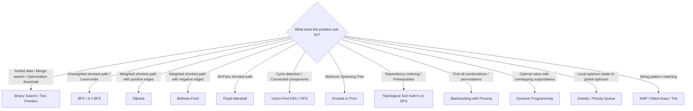

# ⚡ Comprehensive Algorithms Master Guide (DSA Theory)

> A clear, intuitive, and exhaustive theoretical reference for technical interviews. Designed to make complex concepts simple to grasp without omitting critical mathematical foundations, edge cases, or implementation mechanics.

---

## 📑 Table of Contents

1. [Asymptotic Analysis & Mathematical Foundations](#1-asymptotic-analysis--mathematical-foundations)
   - 1.1 Asymptotic Notations ($O, \Omega, \Theta, o, \omega$)
   - 1.2 Complexity Growth Hierarchy
   - 1.3 Amortized Complexity Analysis (Aggregate, Accounting, Potential)
   - 1.4 Master Theorem for Divide-and-Conquer
2. [Searching & Binary Search Variations](#2-searching--binary-search-variations)
   - 2.1 The Core Mental Model: Monotonic Predicates
   - 2.2 Standard Templates (Exact Match, Lower Bound, Upper Bound)
   - 2.3 Binary Search on Answer Space (Min-Max Optimization)
3. [Sorting Algorithms (Comparison & Non-Comparison)](#3-sorting-algorithms)
   - 3.1 Master Comparison Table
   - 3.2 QuickSort Deep Dive (Lomuto vs Hoare vs 3-Way Partitioning)
   - 3.3 MergeSort Mechanics & Linked List Advantage
   - 3.4 Why Building a Binary Heap is $O(n)$
   - 3.5 Non-Comparison Sorts (Counting, Radix, Bucket)
4. [Algorithmic Paradigms](#4-algorithmic-paradigms)
   - 4.1 Divide & Conquer
   - 4.2 Greedy Algorithms & Proof Techniques (Stays Ahead, Exchange Argument)
   - 4.3 Backtracking vs DFS vs Branch-and-Bound
5. [Dynamic Programming (DP) Deep Dive](#5-dynamic-programming-dp-deep-dive)
   - 5.1 Memoization (Top-Down) vs Tabulation (Bottom-Up)
   - 5.2 The 5-Step DP Framework
   - 5.3 Knapsack Patterns: 0/1 Knapsack vs Unbounded Knapsack
   - 5.4 Longest Increasing Subsequence (LIS): $O(n^2)$ vs $O(n \log n)$
6. [Graph Algorithms](#6-graph-algorithms)
   - 6.1 Graph Representations (List vs Matrix vs Edge List)
   - 6.2 Traversals (BFS, DFS, 0-1 BFS)
   - 6.3 Topological Sort & Cycle Detection (Kahn's vs DFS 3-Coloring)
   - 6.4 Shortest Path Algorithms (Dijkstra, Bellman-Ford, Floyd-Warshall)
   - 6.5 Minimum Spanning Tree (MST: Kruskal vs Prim) & DSU
7. [String Search & Pattern Matching](#7-string-search--pattern-matching)
   - 7.1 Knuth-Morris-Pratt (KMP) & The LPS Array
   - 7.2 Rabin-Karp Rolling Hash
   - 7.3 Trie (Prefix Tree) Fundamentals
8. [Bit Manipulation & Mathematical Algorithms](#8-bit-manipulation--mathematical-algorithms)
   - 8.1 Bitwise Operations Cheat Sheet & Clever Tricks
   - 8.2 Number Theory (Euclidean GCD, Sieve of Eratosthenes, Fast Modular Exponentiation)
9. [Algorithm Selection Decision Tree & Interview Cheat Sheet](#9-algorithm-selection-decision-tree--interview-cheat-sheet)

---

## 1. Asymptotic Analysis & Mathematical Foundations

### 1.1 Asymptotic Notations

Asymptotic notation measures how an algorithm's runtime or memory scales as the input size $n$ approaches infinity. It ignores hardware-specific constants and low-order terms.

| Notation | Formal Definition | Intuition | Interview Translation |
| :--- | :--- | :--- | :--- |
| **Big-O ($O$)** | $f(n) \le c \cdot g(n)$ for $n \ge n_0$ | **Upper Bound** | "Will take **at most** this much time/space" (Guaranteed ceiling) |
| **Big-Omega ($\Omega$)** | $f(n) \ge c \cdot g(n)$ for $n \ge n_0$ | **Lower Bound** | "Will take **at least** this much time/space" (Best-case floor) |
| **Big-Theta ($\Theta$)** | $c_1 \cdot g(n) \le f(n) \le c_2 \cdot g(n)$ | **Tight Bound** | "Grows at **exactly** this rate" (Upper and lower match) |
| **Little-o ($o$)** | $\lim_{n \to \infty} \frac{f(n)}{g(n)} = 0$ | **Strict Upper** | Grows strictly slower than $g(n)$ (e.g., $2n = o(n^2)$) |
| **Little-omega ($\omega$)** | $\lim_{n \to \infty} \frac{f(n)}{g(n)} = \infty$ | **Strict Lower** | Grows strictly faster than $g(n)$ (e.g., $n^2 = \omega(n)$) |

```
Growth Curves:
f(n)
 ^
 |             c * g(n)  [Big-O Upper Bound]
 |           /
 |       f(n)            [Actual runtime function]
 |         /
 |      c' * g(n)        [Big-Omega Lower Bound]
 |
 +-------------------------> n
               n0 (threshold where relationship holds forever)
```

> **Interview Distinction**: Engineers colloquially say "Big-O" when they mean the tight bound $\Theta$. If an interviewer asks: *"Is QuickSort $O(n^3)$?"* The technical answer is **yes** ($O(n^3)$ is a valid upper bound), but its tight worst-case bound is $\Theta(n^2)$. Always clarify whether you are reporting average-case tight bound ($\Theta$) or worst-case ceiling ($O$).

---

### 1.2 Complexity Growth Hierarchy

From fastest to slowest:

$$O(1) < O(\log \log n) < O(\log n) < O(\sqrt{n}) < O(n) < O(n \log n) < O(n^2) < O(n^3) < O(2^n) < O(n!) < O(n^n)$$

- **$O(1)$**: Hash table lookup, array indexing, basic math.
- **$O(\log n)$**: Binary search, balanced BST lookup, Euclidean GCD.
- **$O(n)$**: Single pass over array, linear search, tree traversal.
- **$O(n \log n)$**: Optimal comparison sorting (MergeSort, HeapSort).
- **$O(n^2)$**: Bubble sort, nested loops, brute-force pair comparisons.
- **$O(2^n)$**: Generating all subsets, naive recursive Fibonacci.
- **$O(n!)$**: Generating all permutations (Traveling Salesperson brute force).

---

### 1.3 Amortized Complexity Analysis

Amortized analysis guarantees the **average cost per operation over a worst-case sequence** of operations.

> **Difference from Average Case**:
> - **Average-case**: Relies on probabilistic assumptions about inputs (e.g., random data).
> - **Amortized**: Deterministic guarantee over any valid sequence of operations, even if adversarial.

#### The Three Classic Methods

1. **Aggregate Method**:
   Compute the total cost of all $k$ operations in the sequence $T(k)$, then compute the average:
   $$T_{\text{amortized}} = \frac{T(k)}{k}$$

2. **Accounting Method (Banker's Method)**:
   - Assign an artificial "charge" (amortized cost) to each operation.
   - Cheap operations are overcharged; the excess is stored as "credit" on elements in the data structure.
   - Expensive operations consume the saved credit to pay for their true cost.
   - As long as the total credit balance never drops below zero, the assigned charges represent valid upper bounds.

3. **Potential Method (Physicist's Method)**:
   - Define a potential function $\Phi(S)$ representing stored energy in data structure state $S$, where $\Phi(S) \ge \Phi(S_0)$ for all states.
   - Amortized cost for operation $i$: $a_i = c_i + \Phi(S_i) - \Phi(S_{i-1})$ (true cost $+$ change in potential).

#### Concrete Example: Dynamic Array (ArrayList / std::vector) Doubling

- When the array reaches capacity $N$, it allocates a new array of size $2N$ and copies all $N$ elements.
- **True cost of $N$ insertions**:
  - $N$ direct writes into empty slots: cost $= N$.
  - Resizing copies occur at sizes $1, 2, 4, 8, \dots, N$:
    $$\text{Total copies} = 1 + 2 + 4 + \dots + N = 2N - 1 < 2N$$
  - Total cost for $N$ appends = $N + 2N = 3N$.
  - **Amortized cost per append** = $\frac{3N}{N} = O(1)$.

```
Banker's Credit Intuition:
Charge 3 coins per push:
- Coin 1: Pays for the immediate insert.
- Coin 2: Saved on this element to pay for moving itself during the next resize.
- Coin 3: Saved on this element to pay for moving an older element that has already spent its credit.
Result: When the array doubles, every element has exactly enough credit to fund the copy. Balance never drops below zero!
```

---

### 1.4 Master Theorem for Divide-and-Conquer

Solves recurrence relations of the form:

$$T(n) = a \cdot T\left(\frac{n}{b}\right) + f(n)$$

Where:
- $a \ge 1$: Number of subproblems in each step.
- $b > 1$: Factor by which input size is divided.
- $f(n) = \Theta(n^c)$: Work done outside recursion (dividing and combining).

#### The 3-Case Comparison Rule

Compare the work at the leaves, $n^{\log_b a}$, with the work at the root, $f(n)$:

| Case | Condition | Intuition | Resulting Complexity $T(n)$ | Classic Example |
| :---: | :--- | :--- | :---: | :--- |
| **Case 1** | $f(n) = O(n^{\log_b a - \epsilon})$ for $\epsilon > 0$ | **Leaves dominate** (tree is bottom-heavy) | $\Theta(n^{\log_b a})$ | Strassen's Matrix Mult: $T(n) = 7T(n/2) + O(n^2) \implies \Theta(n^{\log_2 7}) \approx \Theta(n^{2.81})$ |
| **Case 2** | $f(n) = \Theta(n^{\log_b a} \log^k n)$ for $k \ge 0$ | **Work is balanced** across all levels | $\Theta(n^{\log_b a} \log^{k+1} n)$ | MergeSort: $T(n) = 2T(n/2) + \Theta(n) \implies \Theta(n \log n)$ ($k=0$)<br>Binary Search: $T(n) = T(n/2) + \Theta(1) \implies \Theta(\log n)$ |
| **Case 3** | $f(n) = \Omega(n^{\log_b a + \epsilon})$ for $\epsilon > 0$ (and regularity: $a f(n/b) \le c f(n)$) | **Root dominates** (tree is top-heavy) | $\Theta(f(n))$ | $T(n) = 2T(n/2) + \Theta(n^2) \implies \Theta(n^2)$ |

---

## 2. Searching & Binary Search Variations

### 2.1 The Core Mental Model: Monotonic Predicates

Binary search is **not** limited to sorted arrays. It applies to **any search space that can be mapped to a monotonic boolean condition**:

```
Search Space:  [ ... elements or values ... ]
Predicate P:    [ F, F, F, F, T, T, T, T, T ]
                              ^
                    First True (Lower Bound)
```

If $P(x) = \text{true} \implies P(x+1) = \text{true}$, we can find the transition point in $O(\log n)$ evaluations.

---

### 2.2 Standard Templates

To avoid infinite loops and off-by-one errors:

#### Template 1: Classic Exact Match (Closed interval `[left, right]`)
Use when searching for a specific value in a sorted array without duplicates.

```typescript
function binarySearchExact(nums: number[], target: number): number {
  let left = 0;
  let right = nums.length - 1; // Both endpoints inclusive

  while (left <= right) {
    const mid = left + Math.floor((right - left) / 2); // Avoid integer overflow
    if (nums[mid] === target) return mid;
    if (nums[mid] < target) {
      left = mid + 1;
    } else {
      right = mid - 1;
    }
  }
  return -1; // Not found
}
```

#### Template 2: Lower Bound / First Element $\ge target$ (Half-open interval `[left, right)`)
Use for finding the first valid index, lower bound, or insertion point.

```typescript
function lowerBound(nums: number[], target: number): number {
  let left = 0;
  let right = nums.length; // Half-open: right is one past the last index

  while (left < right) {
    const mid = left + Math.floor((right - left) / 2);
    if (nums[mid] >= target) {
      right = mid; // Target could be at mid, keep searching left
    } else {
      left = mid + 1; // nums[mid] is strictly < target, discard it
    }
  }
  return left; // Returns index in [0, nums.length]
}
```

#### Template 3: Upper Bound / First Element $> target$

```typescript
function upperBound(nums: number[], target: number): number {
  let left = 0;
  let right = nums.length;

  while (left < right) {
    const mid = left + Math.floor((right - left) / 2);
    if (nums[mid] > target) {
      right = mid;
    } else {
      left = mid + 1;
    }
  }
  return left;
}
```

> **Interview Golden Rule**: Range of target occurrences is `[lowerBound(target), upperBound(target) - 1]`.

---

### 2.3 Binary Search on Answer Space (Min-Max Optimization)

Whenever a problem asks for:
- "Find the **minimum** capacity/speed/cost to achieve X"
- "Find the **maximum** distance/items/allocation such that Y is satisfied"

Translate it into a monotonic feasibility function `isFeasible(mid)`:

```typescript
function binarySearchOnAnswer(minPossible: number, maxPossible: number): number {
  let low = minPossible;
  let high = maxPossible;
  let bestAnswer = maxPossible;

  while (low <= high) {
    const mid = low + Math.floor((high - low) / 2);
    if (isFeasible(mid)) {
      bestAnswer = mid; // Feasible! Record it and try to minimize further
      high = mid - 1;
    } else {
      low = mid + 1;   // Not feasible, must increase capacity
    }
  }
  return bestAnswer;
}
```

*Classic Problems*:
- **Koko Eating Bananas**: Feasibility = can finish all piles within $H$ hours at speed $k$.
- **Capacity To Ship Packages Within D Days**: Feasibility = can ship in $\le D$ days with boat capacity $W$.
- **Aggressive Cows / Split Array Largest Sum**: Feasibility = can place cows with minimum distance $d$.

---

## 3. Sorting Algorithms

### 3.1 Master Comparison Table

| Algorithm | Best Time | Average Time | Worst Time | Space | Stable? | In-Place? | When to Use |
| :--- | :---: | :---: | :---: | :---: | :---: | :---: | :--- |
| **Insertion Sort** | $O(n)$ | $O(n^2)$ | $O(n^2)$ | $O(1)$ | ✅ Yes | ✅ Yes | Small datasets ($n \le 16$) or nearly sorted data. |
| **Selection Sort** | $O(n^2)$ | $O(n^2)$ | $O(n^2)$ | $O(1)$ | ❌ No | ✅ Yes | Never in practice; minimal number of swaps ($O(n)$ writes). |
| **Merge Sort** | $O(n \log n)$ | $O(n \log n)$ | $O(n \log n)$ | $O(n)$ | ✅ Yes | ❌ No | Guaranteed $O(n \log n)$ required; Linked Lists; External sorting. |
| **Quick Sort** | $O(n \log n)$ | $O(n \log n)$ | $O(n^2)$ | $O(\log n)$ | ❌ No | ✅ Yes | General purpose in-memory arrays; excellent cache locality. |
| **Heap Sort** | $O(n \log n)$ | $O(n \log n)$ | $O(n \log n)$ | $O(1)$ | ❌ No | ✅ Yes | Strict $O(1)$ auxiliary space constraint with guaranteed $O(n \log n)$. |
| **TimSort** | $O(n)$ | $O(n \log n)$ | $O(n \log n)$ | $O(n)$ | ✅ Yes | ❌ No | Standard library default (Python `sorted`, Java `Arrays.sort`, V8). |
| **Counting Sort** | $O(n + k)$ | $O(n + k)$ | $O(n + k)$ | $O(k)$ | ✅ Yes | ❌ No | Integers with small range $k \approx O(n)$. |
| **Radix Sort** | $O(d(n + b))$ | $O(d(n + b))$ | $O(d(n + b))$ | $O(n + b)$ | ✅ Yes | ❌ No | Fixed-length integers or strings ($d$ digits in base $b$). |
| **Bucket Sort** | $O(n + k)$ | $O(n + k)$ | $O(n^2)$ | $O(n + k)$ | ✅ Yes | ❌ No | Uniformly distributed floating point numbers in $[0, 1)$. |

---

### 3.2 QuickSort Deep Dive

#### Lomuto vs Hoare Partitioning
- **Lomuto**: Pivot at end. Single forward scanner and boundary pointer. Performs $\approx 3\times$ more swaps than Hoare. Degrades to $O(n^2)$ if all elements are identical.
- **Hoare**: Pointers move inward from both ends until an inversion is found. Performs fewer swaps and handles duplicates gracefully.

#### 3-Way Partitioning (Dutch National Flag)
Standard QuickSort degrades to $O(n^2)$ when an array has many identical elements. 3-Way partitioning divides the array into three sections:
- Values $< \text{pivot}$
- Values $== \text{pivot}$ (already sorted, never touched again!)
- Values $> \text{pivot}$

```
[ < pivot | == pivot | unexamined | > pivot ]
  low..lt-1   lt..i-1      i..gt     gt+1..high
```

```typescript
function threeWayQuickSort(nums: number[], low = 0, high = nums.length - 1): void {
  if (low >= high) return;

  // Pick random pivot to avoid worst-case on already sorted inputs
  const randomPivotIdx = low + Math.floor(Math.random() * (high - low + 1));
  [nums[low], nums[randomPivotIdx]] = [nums[randomPivotIdx], nums[low]];

  const pivot = nums[low];
  let lt = low;      // nums[low..lt-1] < pivot
  let gt = high;     // nums[gt+1..high] > pivot
  let i = low + 1;   // current element under inspection

  while (i <= gt) {
    if (nums[i] < pivot) {
      [nums[lt], nums[i]] = [nums[i], nums[lt]];
      lt++;
      i++;
    } else if (nums[i] > pivot) {
      [nums[i], nums[gt]] = [nums[gt], nums[i]];
      gt--; // Note: do NOT increment i; inspect the newly swapped element at i!
    } else {
      i++;
    }
  }

  // Recursively sort only the sub-arrays strictly less than and strictly greater than pivot
  threeWayQuickSort(nums, low, lt - 1);
  threeWayQuickSort(nums, gt + 1, high);
}
```

---

### 3.3 MergeSort Mechanics & Linked List Advantage

MergeSort splits an array into halves, recursively sorts them, and merges two sorted lists.
- **Why MergeSort for Linked Lists?**
  - Singly Linked Lists can be merged in-place with **$O(1)$ extra space** (re-pointing pointers).
  - Linked Lists lack random access ($O(1)$ indexing), making QuickSort and HeapSort slow due to poor cache performance and $O(n)$ element access.
- **Why MergeSort is Stable**: When merging, if `left[i] === right[j]`, taking `left[i]` first preserves the original input order.

---

### 3.4 Why Building a Binary Heap is $O(n)$

Building a heap by calling `insert` $n$ times is $O(n \log n)$. However, bottom-up `buildHeap` (heapifying from $\lfloor n/2 \rfloor$ down to 0) takes linear time $O(n)$.

**Intuitive Proof**:
- In a complete binary tree of size $n$:
  - $\frac{n}{2}$ nodes are leaves (height $h = 0$) $\implies 0$ sink operations.
  - $\frac{n}{4}$ nodes are at height $h = 1$ $\implies \le 1$ sink swap.
  - $\frac{n}{8}$ nodes are at height $h = 2$ $\implies \le 2$ sink swaps.
  - Only $1$ node (the root) is at height $h = \log n$.
- Sum of all operations:
  $$\sum_{h=0}^{\log n} \frac{n}{2^{h+1}} \cdot h = \frac{n}{2} \sum_{h=0}^{\infty} \frac{h}{2^h} = \frac{n}{2} \cdot 2 = O(n)$$
*Takeaway*: The vast majority of nodes are near the leaves where their height (maximum distance to travel down) is trivial.

---

### 3.5 Non-Comparison Sorts

Comparison-based sorting has a proven mathematical lower bound of $\Omega(n \log n)$ (decision tree of $n!$ leaves has height $\ge \log_2(n!) \approx n \log_2 n$). Non-comparison sorts bypass this by exploiting data properties:

- **Counting Sort**: When keys are integers in range $[0, k]$. Count frequencies, compute prefix sums, and place elements into output. Time: $O(n + k)$, Space: $O(k)$.
- **Radix Sort**: Sorts numbers digit by digit from least significant to most significant (LSD) using a stable sort (like Counting Sort). Time: $O(d \cdot (n + b))$, where $d$ is number of digits and $b$ is the base (e.g., 10 or 256).
- **Bucket Sort**: Divides interval $[0, 1)$ into $n$ equal buckets, distributes numbers into buckets, sorts each bucket (often with insertion sort), and concatenates. Average time: $O(n)$.

---

## 4. Algorithmic Paradigms

### 4.1 Divide & Conquer

1. **Divide**: Break the problem into non-overlapping subproblems of the same type.
2. **Conquer**: Solve subproblems recursively (base case if small enough).
3. **Combine**: Merge subproblem solutions to solve original problem.

*Classic Example: Fast Modular Exponentiation ($a^b \pmod m$)*
Instead of multiplying $a$ by itself $b$ times ($O(b)$):

$$a^b = \begin{cases} (a^{b/2})^2 \pmod m & \text{if } b \text{ is even} \\ a \cdot a^{b-1} \pmod m & \text{if } b \text{ is odd} \end{cases}$$

Runs in **$O(\log b)$** multiplications.

---

### 4.2 Greedy Algorithms & Proof Techniques

A greedy algorithm makes the locally optimal choice at each step without ever backtracking.

#### When Does Greedy Work?
Greedy requires two mathematical properties:
1. **Greedy-Choice Property**: A global optimum can be reached by choosing local optimums.
2. **Optimal Substructure**: An optimal solution to the problem contains optimal solutions to its subproblems.

#### How to Prove a Greedy Strategy Correct

1. **Greedy Stays Ahead**:
   - Compare the greedy solution $G = \{g_1, g_2, \dots, g_k\}$ to an arbitrary hypothetical optimal solution $OPT = \{o_1, o_2, \dots, o_m\}$.
   - Use mathematical induction to prove that at every step $i$, greedy is at least as good as $OPT$ according to a key metric (e.g., finish time, remaining resources).
   - *Example: Interval Scheduling (always pick the earliest ending interval)*.
2. **Exchange Argument**:
   - Assume there exists an optimal solution $OPT$ that differs from greedy solution $G$.
   - Find the first choice where $OPT$ deviates from $G$.
   - Show that swapping that choice in $OPT$ with the greedy choice produces a new solution $OPT'$ that is just as valid and no worse in value.
   - Repeating this gradually converts $OPT$ into $G$ without losing optimality, proving $G$ is optimal.

---

### 4.3 Backtracking vs DFS vs Branch-and-Bound

- **DFS**: Exhaustive traversal of a graph or tree. Explores until leaf, then retreats.
- **Backtracking**: DFS applied to state-space trees with **pruning**. If a partial state cannot possibly lead to a valid solution, immediately prune that branch (e.g., N-Queens, Sudoku).
- **Branch-and-Bound**: Breadth-First exploration guided by bounding functions (often priority queue), typically used for optimization problems (e.g., Traveling Salesperson).

---

## 5. Dynamic Programming (DP) Deep Dive

DP solves optimization and counting problems with:
1. **Overlapping Subproblems**: The same subproblems are solved repeatedly.
2. **Optimal Substructure**: The optimal solution to the problem can be constructed from optimal solutions to its subproblems.

---

### 5.1 Memoization (Top-Down) vs Tabulation (Bottom-Up)

| Metric | Top-Down (Memoization) | Bottom-Up (Tabulation) |
| :--- | :--- | :--- |
| **Direction** | Starts at original problem, recursively breaks it down | Starts at smallest base cases, builds up iteratively |
| **State Evaluation** | Computes **only reachable states** (lazy evaluation) | Computes **all states** in topological order |
| **Overhead** | Recursion stack overhead ($O(n)$ call stack depth) | Flat loops, cache-friendly, zero risk of stack overflow |
| **Space Optimization**| Difficult to discard past states | Straightforward (e.g., compress 2D matrix to 1D or variables) |

---

### 5.2 The 5-Step DP Framework

Every interview DP problem can be solved systematically:
1. **Define the State**: What variables uniquely define a subproblem? (e.g., $dp[i][w] = \text{max value using items } 0..i-1 \text{ with capacity } w$).
2. **Identify Base Cases**: Smallest trivial inputs (e.g., $dp[0][w] = 0$, $dp[i][0] = 0$).
3. **Write the Recurrence Relation**: How to compute $dp[state]$ from previous states.
4. **Determine Traversal Order**: Ensure all dependencies for state $S$ are calculated before $S$.
5. **Optimize Space Complexity**: If state $i$ only depends on state $i-1$, replace full array with two rows or a single array.

---

### 5.3 Knapsack Patterns: 0/1 vs Unbounded

The core difference is whether each item can be used **once** or **infinitely many times**. Notice how loop direction controls element reuse:

#### 0/1 Knapsack (Use each item at most once)
To use a 1D array of size $W+1$, iterate capacity **backwards**:

```typescript
function knapsack01(weights: number[], values: number[], W: number): number {
  const dp = new Array(W + 1).fill(0);

  for (let i = 0; i < weights.length; i++) {
    const weight = weights[i];
    const val = values[i];
    // BACKWARD loop: ensures dp[w - weight] is from the PREVIOUS item, not updated in this round!
    for (let w = W; w >= weight; w--) {
      dp[w] = Math.max(dp[w], dp[w - weight] + val);
    }
  }
  return dp[W];
}
```

#### Unbounded Knapsack (Infinite supply of each item / Coin Change)
Iterate capacity **forwards**:

```typescript
function knapsackUnbounded(weights: number[], values: number[], W: number): number {
  const dp = new Array(W + 1).fill(0);

  for (let i = 0; i < weights.length; i++) {
    const weight = weights[i];
    const val = values[i];
    // FORWARD loop: allows reusing the current item multiple times in the same round!
    for (let w = weight; w <= W; w++) {
      dp[w] = Math.max(dp[w], dp[w - weight] + val);
    }
  }
  return dp[W];
}
```

---

### 5.4 Longest Increasing Subsequence (LIS): $O(n^2)$ vs $O(n \log n)$

- **Standard DP ($O(n^2)$)**:
  $dp[i]$ = length of LIS ending at index $i$.
  $$dp[i] = 1 + \max(\{dp[j] \mid 0 \le j < i \text{ and } nums[j] < nums[i]\} \cup \{0\})$$

- **Patience Sorting + Binary Search ($O(n \log n)$)**:
  Maintain an array `tails` where `tails[len - 1]` stores the smallest tail element of all increasing subsequences of length `len`.
  - For each number $x$:
    - Binary search in `tails` for the first element $\ge x$.
    - If found, replace it with $x$ (lowers the bar for future numbers!).
    - If not found, append $x$ to `tails` (extends the longest subsequence found so far).
  - The length of `tails` at the end is the length of LIS!

---

## 6. Graph Algorithms

### 6.1 Graph Representations

| Representation | Space | Add Edge | Query Edge $(u, v)$ | Iterate Outgoing Neighbors | Best For |
| :--- | :---: | :---: | :---: | :---: | :--- |
| **Adjacency List** | $O(V + E)$ | $O(1)$ | $O(\text{deg}(u))$ | $O(\text{deg}(u))$ | Sparse graphs ($E \ll V^2$). **Interview default**. |
| **Adjacency Matrix** | $O(V^2)$ | $O(1)$ | $O(1)$ | $O(V)$ | Dense graphs ($E \approx V^2$), quick edge lookups. |
| **Edge List** | $O(E)$ | $O(1)$ | $O(E)$ | $O(E)$ | Kruskal's MST, Bellman-Ford (iterating all edges). |

---

### 6.2 Traversals: BFS, DFS, and 0-1 BFS

- **Breadth-First Search (BFS)**:
  - Uses a **FIFO Queue**.
  - Visits nodes level-by-level.
  - **Guarantees shortest path in unweighted graphs** in $O(V + E)$ time.
- **Depth-First Search (DFS)**:
  - Uses a **Call Stack / Explicit Stack**.
  - Explores deep before backtracking.
  - Used for topological sorting, cycle detection, strongly connected components (Tarjan/Kosaraju).
- **0-1 BFS (Weights $\in \{0, 1\}$)**:
  - Uses a **Double-Ended Queue (Deque)**.
  - If edge weight is $0$, push neighbor to **front** of deque.
  - If edge weight is $1$, push neighbor to **back** of deque.
  - Computes shortest paths in $O(V + E)$ time without the $O((V+E)\log V)$ priority queue overhead of Dijkstra!

---

### 6.3 Topological Sort & Cycle Detection

Valid only on **Directed Acyclic Graphs (DAGs)**.

#### Method 1: Kahn's Algorithm (BFS with In-Degrees)
1. Compute in-degree for all vertices.
2. Push all vertices with `in-degree == 0` into a queue.
3. While queue is not empty: pop vertex $u$, add to sorted order, and decrement in-degree of all neighbors. If a neighbor reaches $0$, push to queue.
4. **Cycle Detection**: If count of visited vertices $< V$, graph contains a directed cycle!

#### Method 2: DFS 3-Coloring
- State 0 (`WHITE`): Unvisited.
- State 1 (`GRAY`): Currently visiting (in active recursion stack).
- State 2 (`BLACK`): Fully processed and finished.
- **Rule**: If a neighbor in state 1 (`GRAY`) is encountered, a **back-edge** exists $\implies$ cycle detected!

---

### 6.4 Shortest Path Algorithms Comparison

| Algorithm | Edge Weights | Directed / Undirected | Time Complexity | Space | Core Mechanism |
| :--- | :--- | :--- | :---: | :---: | :--- |
| **BFS** | Unweighted (all 1) | Either | $O(V + E)$ | $O(V)$ | Queue (level-order) |
| **0-1 BFS** | $\{0, 1\}$ only | Either | $O(V + E)$ | $O(V)$ | Deque (`push_front` for 0, `push_back` for 1) |
| **Dijkstra** | Non-negative ($\ge 0$) | Either | $O((V + E) \log V)$ | $O(V)$ | Min-Priority Queue (Greedy) |
| **Bellman-Ford** | Any (supports negatives) | Directed | $O(V \cdot E)$ | $O(V)$ | Dynamic Programming (Relax all $E$ edges $V-1$ times) |
| **Floyd-Warshall** | Any (no negative cycles) | All-Pairs | $O(V^3)$ | $O(V^2)$ | DP: $dp[i][j] = \min(dp[i][j], dp[i][k] + dp[k][j])$ |

> **Why Dijkstra Fails on Negative Weights**: Dijkstra greedily marks a node as finalized the moment it is extracted from the min-heap. A negative edge encountered later could create a shorter path to an already finalized node, invalidating its assumptions.
>
> **Why Bellman-Ford Takes $V-1$ Iterations**: The shortest simple path in a graph with $V$ vertices has at most $V-1$ edges. Each relaxation pass guarantees that paths with one more edge are correctly computed. A $V$-th pass that still reduces any distance proves a **negative-weight cycle** exists.

---

### 6.5 Minimum Spanning Tree (MST) & Disjoint Set Union (DSU)

An MST connects all $V$ vertices with $V-1$ edges while minimizing the total edge weight.

| Feature | Kruskal's Algorithm | Prim's Algorithm |
| :--- | :--- | :--- |
| **Approach** | Edge-centric: sort all edges, pick smallest valid edge | Vertex-centric: grow a single connected tree outwards |
| **Data Structure** | Disjoint Set Union (DSU) | Min-Priority Queue |
| **Time Complexity** | $O(E \log E) = O(E \log V)$ | $O(E \log V)$ (binary heap) |
| **Best For** | Sparse graphs ($E \ll V^2$) | Dense graphs ($E \approx V^2$) |

#### Disjoint Set Union (DSU) Template
Equipped with **Path Compression** and **Union by Rank**:

```typescript
class DSU {
  private parent: number[];
  private rank: number[];

  constructor(n: number) {
    this.parent = Array.from({ length: n }, (_, i) => i);
    this.rank = new Array(n).fill(0);
  }

  // Path compression: points all nodes on path directly to the root
  find(x: number): number {
    if (this.parent[x] !== x) {
      this.parent[x] = this.find(this.parent[x]);
    }
    return this.parent[x];
  }

  // Union by rank: attaches shorter tree under root of taller tree
  union(x: number, y: number): boolean {
    const rootX = this.find(x);
    const rootY = this.find(y);
    if (rootX === rootY) return false; // Cycle detected!

    if (this.rank[rootX] < this.rank[rootY]) {
      this.parent[rootX] = rootY;
    } else if (this.rank[rootX] > this.rank[rootY]) {
      this.parent[rootY] = rootX;
    } else {
      this.parent[rootY] = rootX;
      this.rank[rootX]++;
    }
    return true;
  }
}
```

*Time Complexity*: $O(\alpha(n))$ per operation, where $\alpha$ is the Inverse Ackermann function ($\alpha(n) \le 4$ for all practical inputs $\implies$ effectively $O(1)$).

---

## 7. String Search & Pattern Matching

### 7.1 Knuth-Morris-Pratt (KMP) & The LPS Array

Naive string search rewinds the text pointer after a mismatch ($O(n \cdot m)$ worst case). KMP searches in **$O(n + m)$** by preprocessing the pattern into a Longest Prefix Suffix (**LPS**) array.

#### What does $\text{LPS}[i]$ mean?
$\text{LPS}[i]$ is the length of the longest proper prefix of $P[0..i]$ that is also a suffix of $P[0..i]$.

*Example for pattern `"ABABC"`*:
- `"A"` $\to 0$
- `"AB"` $\to 0$
- `"ABA"` $\to 1$ (prefix `"A"`, suffix `"A"`)
- `"ABAB"` $\to 2$ (prefix `"AB"`, suffix `"AB"`)
- `"ABABC"` $\to 0$
$\implies \text{LPS} = [0, 0, 1, 2, 0]$.

```
When mismatch occurs at pattern index j:
Text:    A  B  A  B  D  ...
Pattern: A  B  A  B  C
                     ^ Mismatch at j = 4

Instead of restarting text at index 1:
Do NOT rewind text! Look up LPS[j - 1] = LPS[3] = 2.
Set j = 2 and compare next!
```

---

### 7.2 Rabin-Karp Rolling Hash

Instead of character-by-character comparison:
1. Compute hash of pattern $P$ of length $m$.
2. Compute hash of the first window of text $T[0..m-1]$.
3. Slide window across text: calculate the next window's hash in **$O(1)$** by subtracting the outgoing character and adding the incoming character.
4. If hashes match, perform character verification (to handle hash collisions).

- **Average Time**: $O(n + m)$.
- **Worst Time** (adversarial collisions): $O(n \cdot m)$.
- **Application**: Ideal for **multiple pattern search** (e.g., matching any of 100 patterns in text using a hash set of pattern hashes).

---

### 7.3 Trie (Prefix Tree) Fundamentals

A tree data structure where each node represents a character. Used for dictionary lookups, prefix autocompletion, and IP routing.
- **Search & Insert**: $O(L)$ where $L$ is the length of the word (independent of the number of words stored).
- **Space**: $O(\Sigma \cdot L \cdot N)$ where $\Sigma$ is alphabet size (can be optimized with Radix tree/Patricia tree).

---

## 8. Bit Manipulation & Mathematical Algorithms

### 8.1 Bitwise Operations Cheat Sheet

| Goal | Operation | Explanation |
| :--- | :--- | :--- |
| **Check if $k$-th bit is 1** | `(n & (1 << k)) !== 0` | Shifts 1 to position $k$, masks everything else |
| **Set $k$-th bit to 1** | `n \|= (1 << k)` | Bitwise OR with mask having 1 at position $k$ |
| **Clear $k$-th bit to 0** | `n &= ~(1 << k)` | Inverted mask has 0 only at position $k$ |
| **Toggle $k$-th bit** | `n ^= (1 << k)` | XOR flips bit at position $k$ |
| **Clear lowest set bit** | `n & (n - 1)` | **Brian Kernighan's trick**: clears rightmost 1-bit |
| **Isolate lowest set bit** | `n & (-n)` | Keeps only the rightmost 1-bit; turns all others to 0 |
| **Check if power of 2** | `n > 0 && (n & (n - 1)) === 0` | Powers of 2 have exactly one 1-bit |
| **Swap two variables** | `a ^= b; b ^= a; a ^= b;` | Works because $x \oplus x = 0$ and $x \oplus 0 = x$ |

---

### 8.2 Number Theory & Math

#### Euclidean Algorithm for GCD
$$\gcd(a, b) = \gcd(b, a \bmod b) \quad \text{with base case } \gcd(a, 0) = a$$
- **Time Complexity**: $O(\log(\min(a, b)))$.
- **LCM formula**: $\text{lcm}(a, b) = \frac{|a \cdot b|}{\gcd(a, b)}$.

#### Sieve of Eratosthenes (Primes up to $N$)
Finds all prime numbers up to $N$ in **$O(n \log \log n)$** time:

```typescript
function sieveOfEratosthenes(n: number): boolean[] {
  const isPrime = new Array(n + 1).fill(true);
  isPrime[0] = false;
  isPrime[1] = false;

  for (let p = 2; p * p <= n; p++) {
    if (isPrime[p]) {
      // Start marking from p * p (earlier multiples already marked by smaller primes)
      for (let multiple = p * p; multiple <= n; multiple += p) {
        isPrime[multiple] = false;
      }
    }
  }
  return isPrime;
}
```

---

## 9. Algorithm Selection Decision Tree & Interview Cheat Sheet

### 9.1 Decision Tree



---

### 9.2 Constraints-to-Complexity Cheat Sheet

Use the input size $N$ from the problem statement to deduce the required time complexity before writing any code:

| Input Size $N$ | Maximum Allowable Complexity | Likely Paradigms |
| :--- | :---: | :--- |
| **$N \le 10$** | $O(N!)$ or $O(N^2 \cdot 2^N)$ | Generating permutations, Traveling Salesperson, Bitmask DP |
| **$N \le 20$** | $O(2^N)$ | Subset generation, Backtracking, Meet-in-the-middle |
| **$N \le 100$** | $O(N^4)$ or $O(N^3)$ | Floyd-Warshall, 3D Dynamic Programming |
| **$N \le 1,000$** | $O(N^2)$ | 2D DP, Nested loops, all-pairs comparisons |
| **$N \le 10^5$ to $10^6$** | $O(N \log N)$ or $O(N)$ | Sorting, Binary Search, Heaps, Sliding Window, Monotonic Stack, Two Pointers |
| **$N \ge 10^9$** | $O(\log N)$ or $O(1)$ | Binary Search on Answer, Fast Exponentiation, Math / Matrix Exponentiation |

---

### 9.3 Top Interview Pitfalls & How to Avoid Them

1. **Integer Overflow in Mid Calculation**:
   Always write `mid = left + Math.floor((right - left) / 2)` instead of `(left + right) / 2`.
2. **Infinite Binary Search Loops**:
   Ensure `left` or `right` changes by at least 1 in every iteration where boundary is closed, or use half-open interval `[left, right)` consistently.
3. **Array Mutation in QuickSort / 3-Way**:
   In 3-way partition, when swapping `nums[i]` with `nums[gt]`, **do not advance `i`** because the incoming swapped element from `gt` has not yet been inspected!
4. **Dijkstra on Negative Edges**:
   Never use Dijkstra if negative edge weights are possible; use Bellman-Ford or SPFA.
5. **Knapsack Loop Direction**:
   - 0/1 Knapsack: loop capacity **backwards** (prevents using current item multiple times).
   - Unbounded Knapsack: loop capacity **forwards** (allows infinite item reuse).
