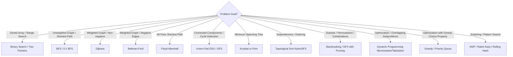

# ⚡ Comprehensive Algorithms Master Guide (DSA Theory)

> A rigorous, in-depth theoretical and implementation reference for software engineering technical interviews. Covers algorithmic paradigms, asymptotic analysis, search/sort mechanics, graph algorithms, dynamic programming, and complexity trade-offs.

---

## 📑 Table of Contents

1. [Asymptotic Analysis & Mathematical Foundations](#1-asymptotic-analysis--mathematical-foundations)
2. [Searching Algorithms & Binary Search Variations](#2-searching-algorithms--binary-search-variations)
3. [Sorting Algorithms (Comparison & Non-Comparison)](#3-sorting-algorithms-comparison--non-comparison)
4. [Divide & Conquer Paradigm](#4-divide--conquer-paradigm)
5. [Greedy Algorithms & Proof Strategies](#5-greedy-algorithms--proof-strategies)
6. [Dynamic Programming (DP) Deep Dive](#6-dynamic-programming-dp-deep-dive)
7. [Graph Algorithms (Traversals, Shortest Paths & MST)](#7-graph-algorithms)
8. [String Search & Pattern Matching Algorithms](#8-string-search--pattern-matching-algorithms)
9. [Bit Manipulation & Mathematical Algorithms](#9-bit-manipulation--mathematical-algorithms)
10. [Algorithm Selection Decision Tree & Interview Cheat Sheet](#10-algorithm-selection-decision-tree--interview-cheat-sheet)

---

## 1. Asymptotic Analysis & Mathematical Foundations

### 1.1 Asymptotic Notations

| Notation                    | Formal Definition                                | Intuition          | Interview Analogy                               |
| :-------------------------- | :----------------------------------------------- | :----------------- | :---------------------------------------------- |
| **Big-O ($O$)**             | $f(n) \le c \cdot g(n)$ for $n \ge n_0$          | Upper Bound        | "Takes at most $X$ time" (Worst-case guarantee) |
| **Big-Omega ($\Omega$)**    | $f(n) \ge c \cdot g(n)$ for $n \ge n_0$          | Lower Bound        | "Takes at least $X$ time" (Best-case floor)     |
| **Big-Theta ($\Theta$)**    | $c_1 \cdot g(n) \le f(n) \le c_2 \cdot g(n)$     | Tight Bound        | "Grows at precisely the rate of $X$"            |
| **Little-o ($o$)**          | $\lim_{n \to \infty} \frac{f(n)}{g(n)} = 0$      | Strict Upper Bound | Grows strictly slower than $g(n)$               |
| **Little-omega ($\omega$)** | $\lim_{n \to \infty} \frac{f(n)}{g(n)} = \infty$ | Strict Lower Bound | Grows strictly faster than $g(n)$               |

> **Interview Caution**: In casual conversation, engineers often say "Big-O of $N$" when they technically mean $\Theta(N)$. In interviews, distinguish whether you are stating an average-case tight bound $\Theta$ or a worst-case upper bound $O$.

### 1.2 Amortized Complexity Analysis

Amortized analysis guarantees the average performance of each operation in the **worst-case sequence** of operations (unlike average-case analysis, which relies on probabilistic input distributions).

#### Common Methods:

1. **Aggregate Method**: Compute total cost for $k$ operations $T(k)$ and average: $T_{\text{amortized}} = \frac{T(k)}{k}$.
2. **Accounting Method (Banker's Method)**: Charge more credit to cheap operations (e.g., charge 3 credits for pushing onto a dynamic array: 1 to insert, 1 to move self on resize, 1 to move an older element).
3. **Potential Method (Physicist's Method)**: Define a potential function $\Phi(S)$ measuring stored work in data structure state $S$. $a_i = c_i + \Phi(S_i) - \Phi(S_{i-1})$.

#### Example: Dynamic Array (Vector/ArrayList) Doubling

- Resizing from size $N$ to $2N$ takes $O(N)$ copies.
- Over $N$ inserts, resizing costs sum to: $1 + 2 + 4 + 8 + \dots + N = 2N - 1 < 2N$.
- Total operations for $N$ inserts: $N \text{ (inserts)} + 2N \text{ (copies)} = 3N$.
- **Amortized cost per append**: $\frac{3N}{N} = O(1)$.

### 1.3 Master Theorem for Recurrence Relations

Applies to divide-and-conquer recurrences of the form:
$$T(n) = a \cdot T\left(\frac{n}{b}\right) + f(n)$$
Where $a \ge 1$ (subproblems per step), $b > 1$ (factor by which input shrinks), and $f(n) = \Theta(n^c)$ is combination cost.

Compare $n^{\log_b a}$ (work at leaves) with $f(n)$ (work at root):

|    Case    | Condition                                                               | Complexity                                 | Intuition                                | Classic Example                                                                                               |
| :--------: | :---------------------------------------------------------------------- | :----------------------------------------- | :--------------------------------------- | :------------------------------------------------------------------------------------------------------------ |
| **Case 1** | $f(n) = O(n^{\log_b a - \epsilon})$ for $\epsilon > 0$                  | $T(n) = \Theta(n^{\log_b a})$              | Tree is bottom-heavy (leaves dominate)   | Strassen's Matrix Multiplication: $T(n) = 7T(n/2) + O(n^2) \to \Theta(n^{\log_2 7}) \approx \Theta(n^{2.81})$ |
| **Case 2** | $f(n) = \Theta(n^{\log_b a} \log^k n)$ for $k \ge 0$                    | $T(n) = \Theta(n^{\log_b a} \log^{k+1} n)$ | Work is evenly distributed across levels | Merge Sort: $T(n) = 2T(n/2) + \Theta(n) \to \Theta(n \log n)$                                                 |
| **Case 3** | $f(n) = \Omega(n^{\log_b a + \epsilon})$ and regularity condition holds | $T(n) = \Theta(f(n))$                      | Tree is top-heavy (root dominates)       | $T(n) = 2T(n/2) + \Theta(n^2) \to \Theta(n^2)$                                                                |

---

## 2. Searching Algorithms & Binary Search Variations

### 2.1 Standard vs Bound Binary Search

Binary Search applies to monotonic (or ordered) search spaces. While textbook binary search checks for equality (`nums[mid] === target`), interview problems almost always require finding **boundaries** (leftmost/rightmost matches or optimization thresholds).

#### 1. Left-Bound Binary Search (Lower Bound / First Element $\ge target$)

```typescript
function lowerBound(nums: number[], target: number): number {
  let left = 0;
  let right = nums.length; // Search range [left, right)

  while (left < right) {
    const mid = left + Math.floor((right - left) / 2);
    if (nums[mid] >= target) {
      right = mid; // Narrow to left half including mid
    } else {
      left = mid + 1;
    }
  }
  return left; // Index of first element >= target, or nums.length if none
}
```

#### 2. Right-Bound Binary Search (Upper Bound / First Element $> target$)

```typescript
function upperBound(nums: number[], target: number): number {
  let left = 0;
  let right = nums.length;

  while (left < right) {
    const mid = left + Math.floor((right - left) / 2);
    if (nums[mid] > target) {
      right = mid;
    } else {
      left = mid + 1;
    }
  }
  return left; // Index of first element > target
}
```

### 2.2 Binary Search on Answer Space (Predicate Optimization)

When asked to find the **minimum valid $X$** or **maximum feasible $Y$**, transform the problem into a monotonic boolean condition:
$$\text{feasible}(k) \implies \text{feasible}(k+1) \quad (\text{or vice versa})$$

#### Standard Template:

```typescript
function binarySearchOnAnswer(minVal: number, maxVal: number): number {
  let low = minVal;
  let high = maxVal;
  let ans = maxVal;

  while (low <= high) {
    const mid = low + Math.floor((high - low) / 2);
    if (isFeasible(mid)) {
      ans = mid; // Record potential optimal answer
      high = mid - 1; // Try to find even smaller valid answer
    } else {
      low = mid + 1; // Increase search space
    }
  }
  return ans;
}
```

_Applications: Koko Eating Bananas, Capacity to Ship Packages Within D Days, Split Array Largest Sum, Aggressive Cows._

---

## 3. Sorting Algorithms (Comparison & Non-Comparison)

### 3.1 Comparison Matrix

| Algorithm          |   Best Time   | Average Time  |  Worst Time   |    Space    | Stable? | In-Place? | Key Mechanism                                                                                    |
| :----------------- | :-----------: | :-----------: | :-----------: | :---------: | :-----: | :-------: | :----------------------------------------------------------------------------------------------- |
| **Insertion Sort** |    $O(n)$     |   $O(n^2)$    |   $O(n^2)$    |   $O(1)$    | ✅ Yes  |  ✅ Yes   | Inserts each item into already sorted prefix; unbeatable for $n \le 16$ or nearly-sorted data    |
| **Merge Sort**     | $O(n \log n)$ | $O(n \log n)$ | $O(n \log n)$ |   $O(n)$    | ✅ Yes  |   ❌ No   | Divide and conquer; optimal for linked lists (O(1) extra space) & external disk sorting          |
| **Quick Sort**     | $O(n \log n)$ | $O(n \log n)$ |   $O(n^2)$    | $O(\log n)$ |  ❌ No  |  ✅ Yes   | Partition around pivot; cache-friendly; worst case on already sorted with naive pivot            |
| **Heap Sort**      | $O(n \log n)$ | $O(n \log n)$ | $O(n \log n)$ |   $O(1)$    |  ❌ No  |  ✅ Yes   | Build max-heap ($O(n)$), repeatedly swap root with end and heapify                               |
| **TimSort**        |    $O(n)$     | $O(n \log n)$ | $O(n \log n)$ |   $O(n)$    | ✅ Yes  |   ❌ No   | Hybrid of Merge Sort + Insertion Sort (used in Python `sorted()` & V8 JS `Array.prototype.sort`) |
| **Counting Sort**  |  $O(n + k)$   |  $O(n + k)$   |  $O(n + k)$   |   $O(k)$    | ✅ Yes  |   ❌ No   | Counts frequency in range $[0, k]$; non-comparison                                               |
| **Radix Sort**     | $O(d(n + b))$ | $O(d(n + b))$ | $O(d(n + b))$ | $O(n + b)$  | ✅ Yes  |   ❌ No   | Digit-by-digit stable counting sort ($d$ digits in base $b$)                                     |

### 3.2 QuickSort Partitioning Schemes Deep Dive

#### Lomuto vs Hoare Partitioning:

- **Lomuto Partition**: Pivot placed at end; one pointer scans, one keeps track of partition boundary. Performs $\approx 3\times$ more swaps on average than Hoare. Degrades to $O(n^2)$ when all elements are equal!
- **Hoare Partition**: Pointers start from both ends and move inward until an inversion is found. Fewer swaps, handles duplicate elements better.

#### 3-Way Partitioning (Dutch National Flag Algorithm):

Crucial when inputs contain **many duplicate values** (avoids $O(n^2)$ degradation in standard QuickSort):

```typescript
function threeWayQuickSort(nums: number[], low = 0, high = nums.length - 1): void {
  if (low >= high) return;

  const pivot = nums[low];
  let lt = low; // nums[low..lt-1] < pivot
  let gt = high; // nums[gt+1..high] > pivot
  let i = low + 1; // nums[lt..i-1] == pivot

  while (i <= gt) {
    if (nums[i] < pivot) {
      [nums[lt], nums[i]] = [nums[i], nums[lt]];
      lt++;
      i++;
    } else if (nums[i] > pivot) {
      [nums[i], nums[gt]] = [nums[gt], nums[i]];
      gt--;
    } else {
      i++;
    }
  }

  threeWayQuickSort(nums, low, lt - 1);
  threeWayQuickSort(nums, gt + 1, high);
}
```

### 3.3 Linear Time Building of a Binary Heap: Why $O(n)$?

Building a heap via $n$ successive insertions is $O(n \log n)$. But `buildHeap` (bottom-up heapify starting from index $\lfloor n/2 \rfloor$ down to $0$) is $\Theta(n)$:

$$\sum_{h=0}^{\lfloor \log_2 n \rfloor} \frac{n}{2^{h+1}} \cdot O(h) = \frac{n}{2} \sum_{h=0}^{\infty} \frac{h}{2^h} = \frac{n}{2} \cdot 2 = O(n)$$
_Intuition_: Most nodes are at the bottom of the tree where the height $h$ (and maximum sink distance) is small ($h=0, 1$), while only 1 node is at the root ($h = \log n$).

---

## 4. Divide & Conquer Paradigm

Divide and conquer works in 3 steps:

1. **Divide**: Break the problem into disjoint subproblems of the same type.
2. **Conquer**: Recursively solve the subproblems. If base case is reached, solve directly.
3. **Combine**: Merge the solutions to subproblems into the solution for the original problem.

### Classic Examples:

1. **Fast Exponentiation ($a^b \pmod m$)**:
   $$a^b = \begin{cases} (a^{b/2})^2 & \text{if } b \text{ is even} \\ a \cdot a^{b-1} & \text{if } b \text{ is odd} \end{cases}$$
   Time Complexity: $O(\log b)$ vs naive $O(b)$.
2. **Closest Pair of Points**:
   - Divide points along the median $x$-coordinate.
   - Conquer: Recursively find closest pair in left half ($\delta_L$) and right half ($\delta_R$). Let $\delta = \min(\delta_L, \delta_R)$.
   - Combine: Check only points within vertical strip $[x_{mid} - \delta, x_{mid} + \delta]$ sorted by $y$-coordinate. Each point needs at most 7 neighbors checked $\to O(n \log n)$.

---

## 5. Greedy Algorithms & Proof Strategies

A greedy algorithm makes the locally optimal choice at each stage with the hope of finding a global optimum.

### Necessary Conditions:

1. **Greedy-Choice Property**: A globally optimal solution can be arrived at by making locally optimal (greedy) choices without reconsidering previous choices.
2. **Optimal Substructure**: An optimal solution to the problem contains optimal solutions to its subproblems.

### Mathematical Proof Techniques for Greedy Solutions:

1. **"Greedy Stays Ahead" Method**:
   - Define a metric of progress for each step $i$.
   - Show by induction that for every step $i$, the greedy choice's progress is at least as good as the hypothetical optimal solution's progress: $g_i \ge o_i$.
2. **"Exchange Argument" Method**:
   - Assume there exists an optimal solution $OPT$ that differs from the greedy solution $G$.
   - Identify the first difference between $OPT$ and $G$.
   - Show that swapping the choice in $OPT$ with the greedy choice results in a solution $OPT'$ that is valid and at least as good as $OPT$.
   - By induction, transform $OPT$ into $G$ without losing optimality, proving $G$ is optimal.

---

## 6. Dynamic Programming (DP) Deep Dive

### 6.1 Memoization vs Tabulation

| Metric                 | Top-Down (Memoization)                                | Bottom-Up (Tabulation)                                    |
| :--------------------- | :---------------------------------------------------- | :-------------------------------------------------------- |
| **Direction**          | Starts at original problem, breaks into subproblems   | Starts at base cases, builds up incrementally             |
| **Control Flow**       | Recursive with hashmap / lookup table                 | Iterative with array / matrix                             |
| **State Evaluation**   | Computes only **reachable** states (lazy evaluation)  | Computes **all** subproblems in topological order         |
| **Overhead**           | Function call stack overhead ($O(N)$ recursion depth) | Cache-friendly loop iterations, no stack overflow         |
| **Space Optimization** | Hard to compress space                                | Easy to compress (rolling array / previous row variables) |

### 6.2 The 5 Steps to Solving Any DP Problem

1. **Define State**: What parameters uniquely identify a subproblem? (e.g., $dp[i][w] = \text{max value using first } i \text{ items with capacity } w$).
2. **Identify Base Cases**: What is the simplest trivially known answer? (e.g., $dp[0][w] = 0$).
3. **Formulate Transition Equation**: How does the state relate to smaller subproblems?
4. **Determine Order of Computation**: In what order must dependencies be resolved? (Topological order of the DAG of subproblems).
5. **Optimize Space Complexity**: Can state $i$ be computed using only state $i-1$ or a single 1D array?

### 6.3 0/1 Knapsack vs Unbounded Knapsack Space Optimization

#### 0/1 Knapsack (Each item used at most once):

```typescript
// Iterating backwards prevents using the same item multiple times in the same step
function knapsack01(weights: number[], values: number[], W: number): number {
  const dp = new Array(W + 1).fill(0);

  for (let i = 0; i < weights.length; i++) {
    for (let w = W; w >= weights[i]; w--) {
      // Reverse iteration!
      dp[w] = Math.max(dp[w], dp[w - weights[i]] + values[i]);
    }
  }
  return dp[W];
}
```

#### Unbounded Knapsack (Infinite supply of each item / Coin Change):

```typescript
// Iterating forward allows using the same item multiple times
function knapsackUnbounded(weights: number[], values: number[], W: number): number {
  const dp = new Array(W + 1).fill(0);

  for (let i = 0; i < weights.length; i++) {
    for (let w = weights[i]; w <= W; w++) {
      // Forward iteration!
      dp[w] = Math.max(dp[w], dp[w - weights[i]] + values[i]);
    }
  }
  return dp[W];
}
```

---

## 7. Graph Algorithms

### 7.1 Representation Comparison

| Feature                 | Adjacency List                         | Adjacency Matrix                   | Edge List |
| :---------------------- | :------------------------------------- | :--------------------------------- | :-------- |
| **Space**               | $O(V + E)$ (Optimal for sparse graphs) | $O(V^2)$ (Heavy for sparse graphs) | $O(E)$    |
| **Add Vertex**          | $O(1)$                                 | $O(V^2)$ (matrix resize)           | $O(1)$    |
| **Add Edge**            | $O(1)$                                 | $O(1)$                             | $O(1)$    |
| **Query Edge $(u, v)$** | $O(\text{deg}(u))$                     | $O(1)$                             | $O(E)$    |
| **Iterate Neighbors**   | $O(\text{deg}(u))$                     | $O(V)$                             | $O(E)$    |

### 7.2 Shortest Path Algorithms Comparison

| Algorithm          | Graph Type            | Weights                 |       Time Complexity       | Space Complexity | Underlying Strategy                                     |
| :----------------- | :-------------------- | :---------------------- | :-------------------------: | :--------------: | :------------------------------------------------------ |
| **BFS**            | Unweighted            | None (or all 1)         |         $O(V + E)$          |      $O(V)$      | Queue (FIFO level order)                                |
| **0-1 BFS**        | Weighted              | Only $\{0, 1\}$         |         $O(V + E)$          |      $O(V)$      | Deque (`push_front` for 0, `push_back` for 1)           |
| **Dijkstra**       | Directed / Undirected | Non-negative ($\ge 0$)  |     $O((V + E) \log V)$     |      $O(V)$      | Min-Priority Queue (Greedy)                             |
| **Bellman-Ford**   | Directed              | Any (handles negatives) |       $O(V \cdot E)$        |      $O(V)$      | Dynamic Programming (Relaxes all $E$ edges $V-1$ times) |
| **Floyd-Warshall** | All-Pairs             | Any (no neg cycles)     |          $O(V^3)$           |     $O(V^2)$     | DP ($dp[i][j] = \min(dp[i][j], dp[i][k] + dp[k][j])$)   |
| **A\* Search**     | Directed / Undirected | Non-negative            | $O(b^d)$ (Heuristic guided) |      $O(V)$      | Best-First Search ($f(n) = g(n) + h(n)$)                |

> **Interview Pro-Tip on Dijkstra vs Bellman-Ford**: Dijkstra fails on negative edge weights because its greedy assumption is broken: once a vertex is popped from the min-heap, Dijkstra assumes its shortest path is finalized. Bellman-Ford relaxes edges $V-1$ times because a simple shortest path can contain at most $V-1$ edges. A $V$-th relaxation that still yields a shorter path confirms the presence of a **negative weight cycle**.

### 7.3 Minimum Spanning Tree (MST): Kruskal vs Prim

| Property             | Kruskal's Algorithm                     | Prim's Algorithm                                |
| :------------------- | :-------------------------------------- | :---------------------------------------------- |
| **Approach**         | Edge-centric (Sort all edges by weight) | Vertex-centric (Grow tree from starting vertex) |
| **Data Structure**   | Disjoint Set Union (DSU / Union-Find)   | Min-Priority Queue                              |
| **Time Complexity**  | $O(E \log E) = O(E \log V)$             | $O(E \log V)$ with binary heap                  |
| **Best Used When**   | Sparse graphs ($E \ll V^2$)             | Dense graphs ($E \approx V^2$)                  |
| **Cycle Prevention** | DSU `find(u) === find(v)`               | Track `visited` set                             |

#### Disjoint Set Union (DSU) with Path Compression & Union by Rank:

```typescript
class DSU {
  private parent: number[];
  private rank: number[];

  constructor(n: number) {
    this.parent = Array.from({ length: n }, (_, i) => i);
    this.rank = new Array(n).fill(0);
  }

  // Path compression: points node directly to root during find
  find(x: number): number {
    if (this.parent[x] !== x) {
      this.parent[x] = this.find(this.parent[x]);
    }
    return this.parent[x];
  }

  // Union by rank: attaches shallower tree under deeper tree
  union(x: number, y: number): boolean {
    const rootX = this.find(x);
    const rootY = this.find(y);
    if (rootX === rootY) return false; // Cycle detected

    if (this.rank[rootX] < this.rank[rootY]) {
      this.parent[rootX] = rootY;
    } else if (this.rank[rootX] > this.rank[rootY]) {
      this.parent[rootY] = rootX;
    } else {
      this.parent[rootY] = rootX;
      this.rank[rootX]++;
    }
    return true;
  }
}
```

_Time Complexity per operation: $O(\alpha(n))$ where $\alpha$ is the Inverse Ackermann function ($\alpha(n) \le 4$ for all practical universe sizes)._

---

## 8. String Search & Pattern Matching Algorithms

### 8.1 Knuth-Morris-Pratt (KMP) Algorithm

Avoids re-examining previously matched characters by preprocessing the pattern into a Longest Prefix Suffix (**LPS**) array:

- $\text{LPS}[i]$ = length of the longest proper prefix of $P[0..i]$ that is also a suffix of $P[0..i]$.
- When mismatch occurs at $P[j]$, instead of resetting $i$ back to $i - j + 1$, keep $i$ fixed and slide pattern by setting $j = \text{LPS}[j - 1]$.
- **Time Complexity**: $O(m)$ preprocessing + $O(n)$ search = $\Theta(n + m)$. Space: $O(m)$.

### 8.2 Rabin-Karp (Rolling Hash)

- Computes hash of pattern $P$ and hash of sliding window $W$ of length $m$ in text $T$.
- Rolling hash computes hash of next window in $O(1)$:
  $$H_{\text{next}} = \left( (H_{\text{curr}} - T[i] \cdot B^{m-1}) \cdot B + T[i + m] \right) \pmod M$$
- **Average Time**: $O(n + m)$. Worst case (many hash collisions): $O(n \cdot m)$.
- Widely used for **multi-pattern matching** and 2D pattern matching.

---

## 9. Bit Manipulation & Mathematical Algorithms

### 9.1 Essential Bitwise Operations Cheat Sheet

| Operation                      | Bitwise Expression             | Explanation                                                          |
| :----------------------------- | :----------------------------- | :------------------------------------------------------------------- | ----------------- |
| **Check if $k$-th bit is set** | `(n & (1 << k)) !== 0`         | Shifts mask to bit $k$ and masks                                     |
| **Set $k$-th bit**             | `n                             | = (1 << k)`                                                          | Sets bit $k$ to 1 |
| **Clear $k$-th bit**           | `n &= ~(1 << k)`               | Flips mask to 0 at $k$ and ANDs                                      |
| **Toggle $k$-th bit**          | `n ^= (1 << k)`                | Inverts bit $k$                                                      |
| **Clear lowest set bit**       | `n & (n - 1)`                  | **Brian Kernighan's trick**: counts set bits in $O(\text{set bits})$ |
| **Isolate lowest set bit**     | `n & (-n)`                     | Two's complement inversion keeps only rightmost 1                    |
| **Check Power of 2**           | `n > 0 && (n & (n - 1)) === 0` | Powers of 2 have exactly one 1-bit                                   |
| **Swap without temp**          | `a ^= b; b ^= a; a ^= b;`      | Uses XOR self-inverse property ($x \oplus x = 0$)                    |

### 9.2 Number Theory: Greatest Common Divisor & Sieve

#### Euclidean Algorithm for GCD:

$$\gcd(a, b) = \gcd(b, a \bmod b) \quad \text{with base case } \gcd(a, 0) = a$$
_Time Complexity_: $O(\log(\min(a, b)))$ by Lamé's Theorem.

#### Sieve of Eratosthenes (Primes up to $N$):

```typescript
function sieve(n: number): boolean[] {
  const isPrime = new Array(n + 1).fill(true);
  isPrime[0] = false;
  isPrime[1] = false;

  for (let p = 2; p * p <= n; p++) {
    if (isPrime[p]) {
      for (let multiple = p * p; multiple <= n; multiple += p) {
        isPrime[multiple] = false;
      }
    }
  }
  return isPrime;
}
```

_Time Complexity_: $O(n \log \log n)$. Space: $O(n)$.

---

## 10. Algorithm Selection Decision Tree & Interview Cheat Sheet



### High-Yield Interview Rules of Thumb

1. **$N \le 10$**: $O(N!)$ or $O(2^N \cdot N)$ $\to$ Backtracking, Bitmask DP.
2. **$N \le 20$**: $O(2^N)$ $\to$ Backtracking, Meet-in-the-middle.
3. **$N \le 100$**: $O(N^4)$ or $O(N^3)$ $\to$ Floyd-Warshall, 3D/4D DP.
4. **$N \le 1,000$**: $O(N^2)$ $\to$ Nested loops, 2D DP, All-pairs distance.
5. **$N \le 100,000$ to $10^6$**: $O(N \log N)$ or $O(N)$ $\to$ Sorting, Binary Search, Heaps, HashMaps, Sliding Window, Monotonic Stack.
6. **$N \ge 10^9$**: $O(\log N)$ or $O(1)$ $\to$ Binary Search on answer, Fast exponentiation, Math / Matrix Exponentiation.
