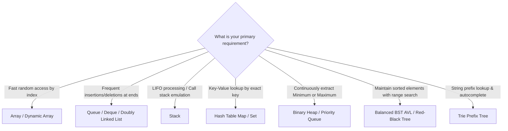

# 🧱 Data Structures Master Guide (Theory & Internals)

> A clear, intuitive, and exhaustive deep-dive into fundamental data structure internals, memory layouts, operation complexities, and interview trade-offs.

---

> 💡 **Related Guides**:
> - For Big-O analysis, spoken guides, and memory internals: [**02-time-space-complexity.md**](./02-time-space-complexity.md)
> - For algorithmic paradigms, sorting, graphs, and DP: [**01-algorithm.md**](./01-algorithm.md)

---

## 📑 Table of Contents

1. [The Core Mental Model: Contiguous vs Node-Based Memory](#1-the-core-mental-model-contiguous-vs-node-based-memory)
2. [Master Operations & Complexity Matrix](#2-master-operations--complexity-matrix)
3. [Arrays & Dynamic Arrays (Vector / ArrayList)](#3-arrays--dynamic-arrays-vector--arraylist)
4. [Linked Lists (Singly, Doubly, Circular)](#4-linked-lists-singly-doubly-circular)
5. [Stacks & Queues (LIFO vs FIFO)](#5-stacks--queues-lifo-vs-fifo)
6. [Hash Tables & Hash Maps](#6-hash-tables--hash-maps)
7. [Trees, BSTs & Balanced Trees (AVL vs Red-Black)](#7-trees-bsts--balanced-trees-avl-vs-red-black)
8. [Binary Heaps & Priority Queues](#8-binary-heaps--priority-queues)
9. [Tries (Prefix Trees)](#9-tries-prefix-trees)
10. [Data Structure Selection Guide & Trade-Offs](#10-data-structure-selection-guide--trade-offs)

---

## 1. The Core Mental Model: Contiguous vs Node-Based Memory

At the physical hardware level, computer RAM is a giant sequential ribbon of bytes, each with a unique memory address. Every data structure in computer science is built on one of two memory allocation strategies:

```
1. Contiguous Memory (Array):
   [ Element 0 ][ Element 1 ][ Element 2 ][ Element 3 ]  <-- Placed back-to-back in RAM

2. Node-Based Memory (Linked List / Tree):
   [ Data | Pointer ] ----> [ Data | Pointer ] ----> [ Data | Null ]
   (at Address 0x104)        (at Address 0x89C)       (at Address 0x412)
```

### Contiguous Memory (Arrays, Strings, Flat Buffers)
- **How it works**: Allocates one solid, unbroken chunk of memory.
- **Cache Locality**: Exceptional. CPUs load memory into high-speed **L1/L2 caches** in 64-byte chunks ("cache lines"). Accessing `arr[0]` automatically loads `arr[1]` and `arr[2]` into the cache for near-instant access.
- **Random Access**: Instant $O(1)$ calculation via pointer arithmetic:
  $$\text{Address}(\text{arr}[i]) = \text{Base Address} + i \times \text{Size of Element}$$
- **Downside**: Resizing requires allocating a brand new memory block and copying all elements.

### Node-Based Memory (Linked Lists, Binary Trees, Graphs)
- **How it works**: Each element ("node") lives wherever the operating system finds free RAM, linked together by pointers / memory addresses.
- **Cache Locality**: Poor. Each pointer jump forces the CPU to fetch from a different, distant RAM address, triggering frequent **cache misses**.
- **Memory Overhead**: Significant. Every node must store both the data AND one or more 8-byte memory pointers (64-bit systems).
- **Advantage**: Dynamic growth with zero resizing or reallocation penalty.

---

## 2. Master Operations & Complexity Matrix

*All complexities are spoken as "Big O of..." (e.g., $O(1)$ = "Big O of one", $O(\log n)$ = "Big O of log n", $O(n)$ = "Big O of n").*

| Data Structure | Access | Search | Insertion | Deletion | Space Overhead | Primary Strength |
| :--- | :---: | :---: | :---: | :---: | :---: | :--- |
| **Array (Static)** | $O(1)$ | $O(n)$ | N/A | N/A | $O(1)$ | Fastest $O(1)$ random access, optimal cache locality |
| **Dynamic Array** | $O(1)$ | $O(n)$ | $O(1)$ amortized ($O(n)$ worst) | $O(n)$ (shift) | $O(n)$ (resizing headroom) | General-purpose sequence default in modern languages |
| **Singly Linked List** | $O(n)$ | $O(n)$ | $O(1)$ at head | $O(1)$ at head | $O(n)$ (1 pointer per node) | Fast prepends/deletions at head without resizing |
| **Doubly Linked List** | $O(n)$ | $O(n)$ | $O(1)$ at head/tail | $O(1)$ given node pointer | $O(n)$ (2 pointers per node) | Bidirectional traversal, $O(1)$ middle node removal (LRU Cache) |
| **Stack (LIFO)** | $O(n)$ | $O(n)$ | $O(1)$ push | $O(1)$ pop | $O(n)$ | Strict LIFO order, parenthesis parsing, undo buffers |
| **Queue (FIFO)** | $O(n)$ | $O(n)$ | $O(1)$ enqueue | $O(1)$ dequeue | $O(n)$ | Order preservation, task scheduling, BFS |
| **Hash Table** | N/A | $O(1)$ avg / $O(n)$ worst | $O(1)$ avg / $O(n)$ worst | $O(1)$ avg / $O(n)$ worst | $O(n)$ (buckets + entries) | Key-value mapping, duplicate detection, instant search |
| **Binary Search Tree**| $O(n)$ | $O(\log n)$ avg / $O(n)$ worst | $O(\log n)$ avg / $O(n)$ worst | $O(\log n)$ avg / $O(n)$ worst | $O(n)$ (2 pointers per node) | Maintains sorted data, range queries |
| **AVL / Red-Black Tree**| $O(\log n)$ | $O(\log n)$ guaranteed | $O(\log n)$ guaranteed | $O(\log n)$ guaranteed | $O(n)$ (pointers + balance bit) | Guaranteed $O(\log n)$ even on adversarial sorted data |
| **Binary Heap** | $O(1)$ peek | $O(n)$ | $O(\log n)$ | $O(\log n)$ extract | $O(1)$ extra (flat array) | Instant $O(1)$ min/max retrieval, priority queues |
| **Trie (Prefix Tree)** | N/A | $O(L)$ word length | $O(L)$ word length | $O(L)$ word length | $O(\Sigma \cdot L \cdot N)$ | Prefix lookups, autocomplete, dictionary spellcheck |

---

## 3. Arrays & Dynamic Arrays (Vector / ArrayList)

### 3.1 Static Arrays
- Fixed size determined at compile time or upon allocation.
- In languages like C/C++, Java, or Go: `int arr[10]` allocates exactly 40 contiguous bytes.
- Direct pointer math makes `arr[i]` a 1-cycle CPU instruction.

### 3.2 Dynamic Arrays (JS `Array`, Python `list`, C++ `std::vector`, Java `ArrayList`)
A dynamic array wraps a static array under the hood, managing capacity transparently:
- **Size ($n$)**: Number of elements currently stored.
- **Capacity ($C$)**: Total number of slots currently allocated in RAM.
- **Doubling Rule**: When $n == C$, it allocates a new array of capacity $2C$, copies all $n$ items, and deallocates the old array.

```
Initial (C=2): [ A | B ]
Push 'C' -> Full!
Allocate (C=4): [ A | B | C | _ ]
Push 'D':       [ A | B | C | D ]
Push 'E' -> Full!
Allocate (C=8): [ A | B | C | D | E | _ | _ | _ ]
```

### 3.3 Insertion & Deletion Costs
- **Append to end**: $O(1)$ amortized time.
- **Insert at index $0$**: $O(n)$ time because every subsequent element must shift one index right.
- **Delete from index $0$**: $O(n)$ time because every remaining element must shift one index left.

---

## 4. Linked Lists (Singly, Doubly, Circular)

### 4.1 Singly Linked List
Each node contains `val` and `next`:

```typescript
class ListNode {
  val: number;
  next: ListNode | null = null;
  constructor(val: number) { this.val = val; }
}
```

- **Head Insertion**: $O(1)$ (create node, point `newNode.next = head`, set `head = newNode`).
- **Tail Insertion**: $O(1)$ if tail pointer maintained, otherwise $O(n)$.
- **Deletion**: Requires a pointer to the **previous node** ($prev$). You cannot delete a node in a singly linked list in $O(1)$ time given only a pointer to that node (unless copying the value of `next` into itself, which fails for the tail node!).

### 4.2 Doubly Linked List
Each node contains `val`, `prev`, and `next`:

```typescript
class DoublyNode {
  val: number;
  prev: DoublyNode | null = null;
  next: DoublyNode | null = null;
  constructor(val: number) { this.val = val; }
}
```

- **True $O(1)$ Deletion**: Given a pointer to `node`, you can disconnect it immediately without needing to scan from the head:
  ```typescript
  node.prev!.next = node.next;
  if (node.next) node.next.prev = node.prev;
  ```
- **Foundation of LRU Cache**: Combined with a Hash Map, a Doubly Linked List provides $O(1)$ `get()` and $O(1)$ `put()` by moving accessed nodes to the front in $O(1)$ time.

### 4.3 Universal Linked List Techniques

#### The Dummy Head Trick (Sentinel Node)
Eliminates tedious edge cases when inserting or deleting at the head of the list:

```typescript
function removeElements(head: ListNode | null, val: number): ListNode | null {
  const dummy = new ListNode(0);
  dummy.next = head;
  let curr: ListNode | null = dummy;

  while (curr && curr.next) {
    if (curr.next.val === val) {
      curr.next = curr.next.next; // Bypass node
    } else {
      curr = curr.next;
    }
  }
  return dummy.next;
}
```

#### Fast & Slow Pointers (Floyd's Tortoise and Hare)
1. **Find Middle Node**: Fast moves 2 steps, Slow moves 1 step. When Fast hits the end, Slow is exactly in the middle.
2. **Detect Cycle**: If Fast and Slow ever point to the same node, a cycle exists.

---

## 5. Stacks & Queues (LIFO vs FIFO)

### 5.1 Stack (Last-In, First-Out — LIFO)
- Operations: `push(x)` ($O(1)$), `pop()` ($O(1)$), `peek()` ($O(1)$).
- **Core Mental Model**: A stack of cafeteria plates. You can only touch the plate on top.
- **Top Interview Use Cases**:
  - Balanced parentheses / syntax verification.
  - Call stack recursion emulation.
  - **Monotonic Stack**: Finding the Next Greater / Smaller Element in $O(n)$ linear time.

### 5.2 Queue (First-In, First-Out — FIFO)
- Operations: `enqueue(x)` ($O(1)$), `dequeue()` ($O(1)$), `front()` ($O(1)$).
- **Core Mental Model**: A line at a grocery store checkout. The first person to join is the first served.
- **Implementation Pitfall**:
  - Using an array with `arr.shift()` for a queue causes $O(n)$ dequeue operations!
  - **Fix**: Use a circular buffer array with `head` and `tail` pointers, or a doubly linked list.
- **Top Interview Use Cases**:
  - Breadth-First Search (BFS) level-order traversal.
  - Buffer for streaming data and async task processing.

### 5.3 Deque (Double-Ended Queue)
Allows $O(1)$ insertions and removals at **both ends**:
- `push_front`, `push_back`, `pop_front`, `pop_back`.
- Essential for **0-1 BFS** on graphs and the **Sliding Window Maximum** problem.

---

## 6. Hash Tables & Hash Maps

A Hash Table stores key-value pairs and maps keys to indices in an internal bucket array via a **Hash Function**:

$$\text{Bucket Index} = \text{hash}(\text{key}) \pmod{\text{Bucket Array Size}}$$

```
Key: "apple"  ---> [ Hash Function: 3284729 ] ---> % 8 ---> Index 1
Key: "banana" ---> [ Hash Function: 9482710 ] ---> % 8 ---> Index 6
```

### 6.1 Collision Resolution Strategies

When two different keys produce the same bucket index ($\text{hash}(k_1) \pmod m == \text{hash}(k_2) \pmod m$):

#### 1. Separate Chaining
Each bucket stores a linked list (or balanced tree) of entries that collided at that index:
- **Lookup**: Hash the key, jump to the bucket, scan the chain for matching key.
- **Java 8+ Optimization**: When a bucket chain exceeds 8 elements (and table capacity $\ge 64$), the linked list converts into a **Red-Black Tree**, upgrading worst-case search from $O(n)$ to $O(\log n)$.

#### 2. Open Addressing (No Extra Pointers)
All entries are stored directly in the bucket array itself. If a bucket is occupied, search for the next available slot:
- **Linear Probing**: Check $i + 1, i + 2, i + 3, \dots$ (suffers from *primary clustering*).
- **Quadratic Probing**: Check $i + 1^2, i + 2^2, i + 3^2, \dots$
- **Double Hashing**: Step size is determined by a second hash function: $i + k \cdot \text{hash}_2(\text{key})$.
- **Deletion**: Requires leaving a special **"tombstone" marker** so future searches do not mistakenly stop early thinking the key was never inserted.

### 6.2 Load Factor ($\alpha$) & Rehashing
$$\text{Load Factor } \alpha = \frac{\text{Number of elements stored } (n)}{\text{Total number of buckets } (m)}$$
- If $\alpha$ becomes too high, collisions skyrocket, and performance degrades from $O(1)$ toward $O(n)$.
- **Rehashing**: When $\alpha$ crosses a threshold (typically $\mathbf{0.70}$ or $\mathbf{0.75}$), the hash table allocates an array with $2\times$ the buckets and re-hashes every existing element into their new locations.

---

## 7. Trees, BSTs & Balanced Trees (AVL vs Red-Black)

### 7.1 Tree Terminology
- **Root**: Topmost node without a parent.
- **Leaf**: Node with 0 children.
- **Depth of a node**: Number of edges from root to that node.
- **Height of a tree**: Maximum depth among all nodes (number of edges on the longest path to a leaf).

### 7.2 Binary Search Tree (BST)
A binary tree where for every node:
- All values in the **Left Subtree** are **strictly smaller** ($< \text{node.val}$).
- All values in the **Right Subtree** are **strictly greater** ($> \text{node.val}$).
- **In-Order Traversal** of a BST visits nodes in strictly sorted order!

```
        8
       / \
      3   10
     / \    \
    1   6    14
```

#### The BST Worst-Case Pitfall ($O(n)$)
If elements are inserted in already-sorted order (`[1, 2, 3, 4, 5]`), a standard BST degrades into a **Linked List**:

```
1
 \
  2
   \
    3  --> Height = n --> Search becomes O(n) instead of O(log n)!
```

### 7.3 Self-Balancing Binary Trees: AVL vs Red-Black

To guarantee $O(\log n)$ operations regardless of input order, trees automatically re-balance using **rotations**:

```
Right Rotation on Node B:
        B                   A
       / \                 / \
      A   C     ===>      D   B
     / \                     / \
    D   E                   E   C
```

| Feature | AVL Tree | Red-Black Tree |
| :--- | :--- | :--- |
| **Balance Strictness** | **Strict**: $\| \text{height}(L) - \text{height}(R) \| \le 1$ | **Loose**: Longest path $\le 2 \times$ shortest path |
| **Max Height** | $\approx 1.44 \log_2 n$ | $\approx 2.0 \log_2 n$ |
| **Lookup Speed** | Faster (flatter, shorter tree) | Slightly slower (up to $2\times$ deeper) |
| **Insert / Delete Speed**| Slower (more frequent tree rotations) | Faster (fewer rotations on average) |
| **Real-World Uses** | Read-heavy databases, in-memory caches | `std::map`, `std::set` in C++, Java `TreeMap`, Linux scheduler |

---

## 8. Binary Heaps & Priority Queues

A **Binary Heap** is a **Complete Binary Tree** (every level is completely filled, except possibly the last level which is filled from left to right) satisfying the **Heap Property**:
- **Min-Heap**: Parent value $\le$ Children values (Root is always the minimum).
- **Max-Heap**: Parent value $\ge$ Children values (Root is always the maximum).

### 8.1 The Array Representation (Zero Pointer Overhead!)

Because the tree is strictly complete, it requires **zero pointers** and is stored directly in a flat array:

```
Tree Form:
            10 (Index 0)
          /    \
  (1)   15      20   (2)
       /  \    /
 (3) 30   40  50 (5)

Array Form:
Index:   0   1   2   3   4   5
Value: [10, 15, 20, 30, 40, 50]
```

#### The Pointer Math:
- **Left Child**: $2i + 1$
- **Right Child**: $2i + 2$
- **Parent**: $\lfloor \frac{i - 1}{2} \rfloor$

### 8.2 Core Operations
1. **`insert(val)` ($O(\log n)$)**:
   - Place new value at the very end of the array (bottom-right of tree).
   - **Bubble Up (Heapify Up)**: Swap with parent while heap property is violated.
2. **`extractMin()` ($O(\log n)$)**:
   - Save root value to return.
   - Move the last element of the array into the root position.
   - **Bubble Down (Heapify Down)**: Swap with the smaller of its two children until heap property is restored.
3. **`peek()` ($O(1)$)**: Read `arr[0]`.

---

## 9. Tries (Prefix Trees)

A specialized tree used to store associative arrays where keys are usually strings. Unlike a BST, no node stores its full key; its position in the tree defines its key.

```
       (root)
      /      \
     c        b
    /          \
   a            a
  / \            \
 t   r            t
(end) \          (end)
       t
      (end)
Words stored: "cat", "cart", "bat"
```

### 9.1 Node Structure

```typescript
class TrieNode {
  children: Map<string, TrieNode> = new Map();
  isEndOfWord: boolean = false;
}

class Trie {
  private root = new TrieNode();

  insert(word: string): void {
    let curr = this.root;
    for (const ch of word) {
      if (!curr.children.has(ch)) {
        curr.children.set(ch, new TrieNode());
      }
      curr = curr.children.get(ch)!;
    }
    curr.isEndOfWord = true;
  }

  startsWith(prefix: string): boolean {
    let curr = this.root;
    for (const ch of prefix) {
      if (!curr.children.has(ch)) return false;
      curr = curr.children.get(ch)!;
    }
    return true;
  }
}
```

- **Lookup & Insertion**: $O(L)$ time, where $L$ is word length (independent of the millions of words in the dictionary!).
- **Interview Applications**: Autocomplete search bars, spell checkers, IP prefix routing, word boggle solvers.

---

## 10. Data Structure Selection Guide & Trade-Offs

### 10.1 Decision Flowchart



### 10.2 Cheat Sheet: Choosing Between Similar Structures

| Scenario | Choose This | Over This | Why? |
| :--- | :--- | :--- | :--- |
| Known max size, random access | **Static Array** | Dynamic Array | Avoids capacity headroom and reallocation checks. |
| Frequent middle deletions with known node pointer | **Doubly Linked List** | Dynamic Array | $O(1)$ removal without shifting remaining elements. |
| Need $O(1)$ exact lookup | **Hash Map** | Balanced BST | $O(1)$ average lookup vs $O(\log n)$ tree comparison overhead. |
| Need sorted iteration or floor/ceiling queries | **Balanced BST** | Hash Map | Hash Map loses all ordering; BST answers order queries in $O(\log n)$. |
| Frequent priority extraction (Min/Max) | **Binary Heap** | Balanced BST | Binary Heap uses a flat array with zero pointer overhead and faster constants. |
| String prefix matching | **Trie** | Hash Set | Trie shares common prefixes among words, avoiding hash collisions on long strings. |
