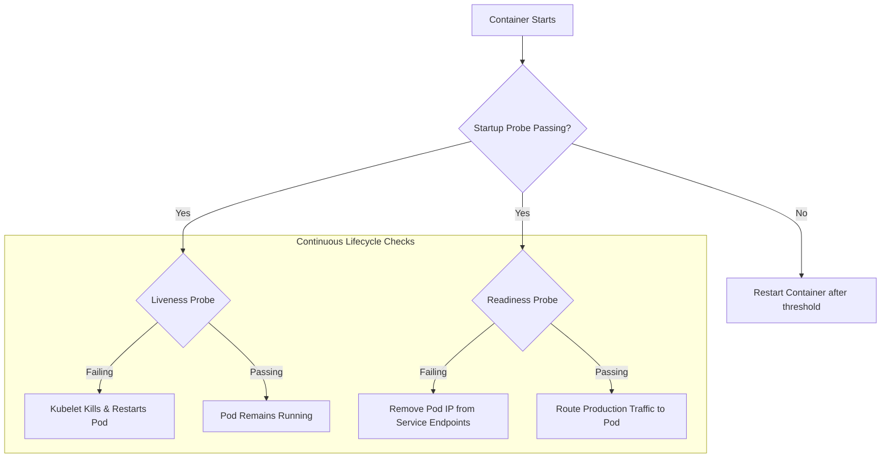

# ☸️ Kubernetes (K8s) Interview Master Guide (50 Questions)

> A production-grade study guide containing **50 in-depth interview questions, architectural breakdowns, YAML manifests, networking & storage internals, and troubleshooting playbooks** for Kubernetes & Cloud-Native engineering interviews.

---

## 📑 Table of Contents

- [1. Kubernetes Architecture & Control Plane (Q1–Q10)](#1-kubernetes-architecture--control-plane)
- [2. Pods, Workloads & Controllers (Q11–Q20)](#2-pods-workloads--controllers)
- [3. Services, Ingress & K8s Networking (Q21–Q29)](#3-services-ingress--k8s-networking)
- [4. Storage, Volumes, PV & PVC (Q30–Q34)](#4-storage-volumes-pv--pvc)
- [5. Configuration, Secrets & RBAC Security (Q35–Q40)](#5-configuration-secrets--rbac-security)
- [6. Autoscaling (HPA, VPA, Cluster Autoscaler) & Scheduling (Q41–Q45)](#6-autoscaling-hpa-vpa-cluster-autoscaler--scheduling)
- [7. Troubleshooting, Helm & Production Operations (Q46–Q50)](#7-troubleshooting-helm--production-operations)

---

# 🚀 50 In-Depth Interview Questions & Answers

---

### 1. Kubernetes Architecture & Control Plane

#### 1. What is Kubernetes (K8s) and what core problems does it solve?
Kubernetes is an open-source container orchestration platform that automates the deployment, horizontal scaling, self-healing, load balancing, and lifecycle management of containerized applications across clusters of physical or virtual machines.
- **Problems Solved**:
  - Eliminates manual server provisioning and individual container restarts.
  - Automated zero-downtime rolling updates and rollbacks.
  - Efficient server resource utilization via automated bin-packing.
  - Service discovery and internal/external load balancing.

---

#### 2. Explain the high-level architecture of a Kubernetes Cluster.
A Kubernetes cluster consists of two distinct planes:
1. **Control Plane (Master Nodes)**: Manages cluster state, scheduling, API requests, and controller loops.
   - `kube-apiserver`
   - `etcd`
   - `kube-scheduler`
   - `kube-controller-manager`
   - `cloud-controller-manager`
2. **Worker Nodes (Data Plane)**: Runs the actual application container workloads.
   - `kubelet`
   - `kube-proxy`
   - Container Runtime (`containerd`, `CRI-O`)

---

#### 3. What is the role of each Control Plane component?
- **`kube-apiserver`**: The central REST API gateway exposing the Kubernetes API. All internal components and external clients (`kubectl`) interact through it. Validates and configures data for objects.
- **`etcd`**: A distributed, consistent, highly-available key-value store (using the Raft consensus algorithm) serving as the single source of truth for all cluster state and secrets.
- **`kube-scheduler`**: Watches for newly created Pods with no assigned node and selects the optimal worker node based on resource requests, taints/tolerations, affinity, and topology.
- **`kube-controller-manager`**: Runs core controller daemon loops (e.g., Node Lifecycle Controller, ReplicaSet Controller, EndpointSlice Controller, ServiceAccount Controller) comparing desired state vs actual state.
- **`cloud-controller-manager`**: Integrates with underlying cloud provider APIs (e.g., AWS, GCP, Azure) for provisioning cloud load balancers, node routing, and EBS/persistent disks.

---

#### 4. What is the role of each Worker Node component?
- **`kubelet`**: The primary node agent that registers the node with the API server, watches assigned PodSpecs, and commands the local container runtime via CRI to start, stop, and health-check containers.
- **`kube-proxy`**: A network proxy running on each node that maintains network rules (`iptables` or IPVS mode) to route Service IP (ClusterIP) traffic to backend Pod endpoints.
- **Container Runtime**: The software responsible for downloading images and running containers (e.g., `containerd`, `CRI-O`) conforming to the Container Runtime Interface (CRI).

---

#### 5. What is the Container Runtime Interface (CRI)? Why was Docker direct support deprecated in favor of `containerd`?
CRI is a gRPC-based plugin interface that allows `kubelet` to use a wide variety of container runtimes without recompiling Kubernetes.
- **Deprecation of Dockershim**: Docker was not originally built to implement CRI directly; Kubernetes maintained a complex translation shim called `dockershim`. Kubernetes removed `dockershim` in v1.24 to talk directly to lightweight, compliant runtimes like `containerd` and `CRI-O`, reducing latency and memory overhead.

---

#### 6. What is `etcd`, how does it handle quorum, and why is an odd number of master nodes required?
`etcd` uses the **Raft consensus algorithm** to ensure strong data consistency across distributed nodes.
- Quorum is defined as `(N/2) + 1` where `N` is the cluster size.
  - A 3-node cluster can tolerate 1 failure (`quorum = 2`).
  - A 5-node cluster can tolerate 2 failures (`quorum = 3`).
- An **odd number** of nodes (3 or 5) prevents "split-brain" scenarios during network partitions while optimizing failure tolerance without wasting resources (a 4-node cluster still only tolerates 1 failure).

---

#### 7. What is a Declarative vs Imperative approach in Kubernetes?
- **Imperative (`kubectl run`, `kubectl expose`, `kubectl create`)**: Tells Kubernetes **what actions to take step-by-step** (e.g., "create a pod named X, scale deployment Y to 3").
- **Declarative (`kubectl apply -f manifest.yaml`)**: Declares the **desired end state** in a YAML file. Kubernetes controllers continuously reconcile the current state to match this desired state.
- *Best Practice*: Declarative configuration is essential for GitOps and reproducible environments.

---

#### 8. What happens internally when you run `kubectl apply -f deployment.yaml`?
1. **Client**: `kubectl` validates the YAML client-side and sends an HTTP POST/PUT request to `kube-apiserver`.
2. **Authentication & Authorization**: API server authenticates the user (via TLS cert/token) and verifies RBAC permissions.
3. **Admission Control**: Mutating and Validating Admission Webhooks inspect and modify the spec if needed.
4. **Persist to `etcd`**: The Deployment record is written to `etcd`.
5. **Deployment Controller**: Detects the new Deployment and creates a **ReplicaSet**.
6. **ReplicaSet Controller**: Creates the specified number of **Pod** objects in an `Unscheduled` state.
7. **Scheduler**: Evaluates node capacity and assigns each Pod to a Worker Node (`spec.nodeName`).
8. **Kubelet**: Node's `kubelet` detects the Pod assignment, instructs `containerd` to pull the image, sets up the network sandbox via CNI, mounts volumes, and starts the container.

---

#### 9. What are Custom Resource Definitions (CRDs) and the Operator Pattern?
- **CRD**: Extends the Kubernetes API by introducing custom object types (e.g., `kind: DatabaseCluster` or `kind: KafkaTopic`).
- **Operator Pattern**: Combines a CRD with a **Custom Controller** that encodes human operational domain knowledge (e.g., automated database backups, failovers, schema migrations, and upgrades).

---

#### 10. What is `kubectl` context and kubeconfig file structure?
The `kubeconfig` file (default `~/.kube/config`) stores cluster endpoints, user credentials, and contexts.
- **Context**: A tuple linking a specific **User**, a specific **Cluster**, and a default **Namespace**.
```bash
# Switch context between staging and prod
kubectl config use-context aws-eks-production

# Switch default namespace
kubectl config set-context --current --namespace=finance
```

---

### 2. Pods, Workloads & Controllers

#### 11. What is a Pod and why does Kubernetes use Pods instead of running containers directly?
A **Pod** is the smallest deployable atomic execution unit in Kubernetes. It encapsulates one or more containers that:
- Share the same **Network Namespace** (share the same IP address and `localhost` port space).
- Share the same **IPC Namespace** (shared memory).
- Share common **Storage Volumes** mounted into container directories.
- Containers in the same pod are co-located, co-scheduled, and run in the exact same execution context.

---

#### 12. What are Init Containers and Sidecar Containers?
- **Init Containers**: Specialized containers that run and **must run to completion** sequentially before application containers start. Ideal for waiting for a database to become reachable or downloading configuration files.
- **Sidecar Containers**: Auxiliary containers that run alongside the main application container to extend its functionality (e.g., log forwarders like FluentBit, Envoy service mesh proxies, or secret synchronization agents).

```yaml
spec:
  initContainers:
  - name: wait-for-db
    image: busybox:1.36
    command: ['sh', '-c', 'until nc -z postgres-service 5432; do sleep 2; done;']
  containers:
  - name: main-app
    image: my-app:v1
```

---

#### 13. What is the difference between Deployment, StatefulSet, DaemonSet, Job, and CronJob?

| Workload Type | Key Characteristics | Production Use Case |
| :--- | :--- | :--- |
| **Deployment** | Stateless, interchangeable pods, ephemeral pod names and storage, rolling updates. | Web APIs, microservices, frontend apps. |
| **StatefulSet** | Stable unique network IDs (`pod-0`, `pod-1`), ordered deployment/scaling, dedicated PVCs per pod. | Databases (PostgreSQL, MongoDB, Kafka, Elasticsearch). |
| **DaemonSet** | Guarantees exactly **one copy** of a Pod runs on every matching worker node in the cluster. | Node log collectors (`fluentd`), monitoring daemons (`node-exporter`), CNI agents. |
| **Job** | Runs pods to completion (until success exit code `0`), then terminates. | DB migrations, batch processing, report generation. |
| **CronJob** | Runs Jobs periodically on a cron schedule (`*/15 * * * *`). | Nightly data backups, scheduled batch billing. |

---

#### 14. What are Liveness, Readiness, and Startup Probes?



- **Startup Probe**: Determines if the application inside the container has initialized (great for slow-booting legacy apps). Disables liveness and readiness checks until it succeeds.
- **Readiness Probe**: Determines if the container is ready to accept incoming user network traffic. If it fails, Kubernetes removes the pod IP from the Service endpoints without killing the container.
- **Liveness Probe**: Determines if the container is still alive. If it fails (e.g., deadlocked thread), `kubelet` kills the container and initiates a restart according to its `restartPolicy`.

---

#### 15. What are the Probe check mechanisms available in Kubernetes?
1. **`httpGet`**: Sends an HTTP GET request; status codes `200 <= code < 400` indicate success.
2. **`tcpSocket`**: Attempts to open a TCP socket connection on a specified port.
3. **`exec`**: Runs an arbitrary command inside the container; exit status `0` indicates success.
4. **`grpc`**: Sends standard gRPC health checking protocol requests.

---

#### 16. What are Pod Lifecycle Phases and Container States?
- **Pod Phases**:
  - `Pending`: Pod accepted by cluster, but waiting for scheduling, image download, or volume mounts.
  - `Running`: Bound to a node and at least one container is running or starting.
  - `Succeeded`: All containers terminated successfully (exit code 0).
  - `Failed`: All containers terminated and at least one container failed.
  - `Unknown`: State cannot be obtained (usually worker node loss).
- **Container States**: `Waiting`, `Running`, `Terminated`.

---

#### 17. What causes `CrashLoopBackOff` and how do you diagnose it?
`CrashLoopBackOff` means a container starts, encounters an error, exits, and `kubelet` attempts to restart it with an exponentially increasing backoff delay (10s, 20s, 40s... up to 5 min).
- **Common Causes**:
  - Missing environment variables or malformed configuration secrets.
  - Port conflict or database connection timeout.
  - Application fatal error / unhandled exception.
  - OOMKilled (Out of Memory).
- **Diagnosis Command**:
```bash
kubectl describe pod <pod-name>
kubectl logs <pod-name> --previous  # View logs from the failed crash instance
```

---

#### 18. What causes `ImagePullBackOff` or `ErrImagePull`?
- Typos in the image name or tag.
- Image does not exist in registry.
- Private registry authentication failure (missing or misconfigured `imagePullSecrets`).
- Rate limiting on public registries (e.g. Docker Hub anonymous pull limits).

---

#### 19. How do you implement zero-downtime Rolling Updates in a Deployment?
By configuring `strategy.rollingUpdate.maxSurge` and `maxUnavailable`:

```yaml
spec:
  replicas: 4
  strategy:
    type: RollingUpdate
    rollingUpdate:
      maxSurge: 25%         # Can spawn 1 extra pod above desired replicas (5 total)
      maxUnavailable: 0     # 0 pods can be unavailable during the update
```
- Ensures new pods become fully **Ready** (passing readiness probes) before old pods receive `SIGTERM`.

---

#### 20. What is a Pod Disruption Budget (PDB)?
A PDB limits the number of pods of a replicated application that can be simultaneously down from voluntary disruptions (e.g., node drain during cluster upgrades, node autoscaling down).

```yaml
apiVersion: policy/v1
kind: PodDisruptionBudget
metadata:
  name: api-pdb
spec:
  minAvailable: 2
  selector:
    matchLabels:
      app: api-service
```

---

### 3. Services, Ingress & K8s Networking

#### 21. What are the four core Kubernetes Network Model requirements?
1. Every Pod gets its own unique, routable IP address across the entire cluster.
2. Containers within a Pod can communicate with each other over `localhost`.
3. All Pods can communicate with all other Pods on any node without NAT.
4. Agents on a node (e.g., `kubelet`) can communicate with all Pods on that same node.

---

#### 22. What is a CNI (Container Network Interface) plugin? Name popular ones.
A CNI plugin is responsible for inserting network interfaces into container network namespaces and allocating IP addresses.
- **Calico**: High-performance networking with advanced NetworkPolicy firewall enforcement.
- **Flannel**: Lightweight overlay networking (VXLAN).
- **Cilium**: Modern, ultra-fast networking and observability using Linux **eBPF**.
- **AWS VPC CNI**: Assigns real, native AWS VPC IP addresses directly to Pods in Amazon EKS.

---

#### 23. Explain the four Kubernetes Service Types.

| Service Type | Scope | How it Works |
| :--- | :--- | :--- |
| **`ClusterIP`** (Default) | Internal | Assigns a stable internal cluster virtual IP. Reachable only from inside the cluster. |
| **`NodePort`** | External | Opens a dedicated high-range port (`30000–32767`) on every worker node's physical IP. |
| **`LoadBalancer`** | External | Interacts with Cloud Provider (AWS, GCP, Azure) to provision an external cloud load balancer (e.g., AWS NLB/ALB). |
| **`ExternalName`** | Internal Alias | Maps the Service to a DNS CNAME record (e.g., external RDS database `db.rds.amazonaws.com`). |

---

#### 24. What are EndpointSlices and Endpoints?
- **Endpoints**: Legacy object containing a list of IP addresses and ports for Pods matching a Service's label selector.
- **EndpointSlices**: Scalable successor to Endpoints. Breaks large collections of endpoints into discrete slices (default 100 endpoints per slice), significantly reducing API server load and `iptables` sync overhead in large clusters.

---

#### 25. How does `kube-proxy` work in `iptables` vs `IPVS` modes?
- **`iptables` Mode**: `kube-proxy` writes deterministic sequential packet-filtering rules.
  - *Limitation*: Rule evaluation is `O(N)`. As services grow past 5,000+, packet processing latency increases noticeably.
- **`IPVS` Mode (IP Virtual Server)**: Uses Linux kernel hash tables (`O(1)` lookup) and supports advanced load-balancing algorithms (least connection, weighted, round-robin), ideal for massive scale.

---

#### 26. How does Internal CoreDNS Resolution work in Kubernetes?
Kubernetes runs an internal DNS server (CoreDNS).
- Standard FQDN (Fully Qualified Domain Name) format for a Service:
  `<service-name>.<namespace>.svc.cluster.local`
- Example: A pod in the `auth` namespace connecting to PostgreSQL in the `database` namespace connects to:
  `postgres-service.database.svc.cluster.local:5432`

---

#### 27. What is an Ingress Controller vs Ingress Resource?
- **Ingress Resource**: A declarative YAML object defining Layer 7 routing rules (hostnames, SSL certificates, URI paths).
- **Ingress Controller**: The actual reverse proxy daemon (e.g., **Nginx Ingress Controller**, **Traefik**, **AWS Load Balancer Controller**) that monitors Ingress resources and configures load balancing routes dynamically.

```yaml
apiVersion: networking.k8s.io/v1
kind: Ingress
metadata:
  name: app-ingress
  annotations:
    cert-manager.io/cluster-issuer: letsencrypt-prod
spec:
  tls:
  - hosts:
    - api.company.com
    secretName: api-tls-cert
  rules:
  - host: api.company.com
    http:
      paths:
      - path: /v1/users
        pathType: Prefix
        backend:
          service:
            name: user-service
            port:
              number: 80
```

---

#### 28. What is a Headless Service and when do you use it?
A Headless Service is defined with `spec.clusterIP: None`.
- Instead of returning a single load-balanced virtual ClusterIP, CoreDNS returns the **direct A records (individual IPs) of all matching healthy pods**.
- **Use Case**: Stateful distributed systems (Cassandra, Kafka, MongoDB replica sets, Elasticsearch) where the client or leader election mechanism needs direct peer-to-peer communication.

---

#### 29. What is a NetworkPolicy and how do you secure pod-to-pod communication?
By default, Kubernetes networking is flat: any pod can communicate with any other pod in the cluster.
- **NetworkPolicy**: Acts as an internal firewall at Layer 3/4.
```yaml
apiVersion: networking.k8s.io/v1
kind: NetworkPolicy
metadata:
  name: db-policy
  namespace: database
spec:
  podSelector:
    matchLabels:
      app: postgres
  ingress:
  - from:
    - namespaceSelector:
        matchLabels:
          environment: production
      podSelector:
        matchLabels:
          app: backend-api
    ports:
    - protocol: TCP
      port: 5432
```
*(Requires a CNI that supports NetworkPolicies, such as Calico or Cilium).*

---

### 4. Storage, Volumes, PV & PVC

#### 30. What is the difference between an ephemeral volume, PersistentVolume (PV), and PersistentVolumeClaim (PVC)?
- **Ephemeral Volumes (`emptyDir`)**: Created when a Pod is assigned to a node; exists only as long as that Pod is running on that node. Wiped out when the Pod is deleted.
- **PersistentVolume (PV)**: A piece of cluster-wide storage provisioned by an administrator or dynamically created by a StorageClass (e.g., AWS EBS volume, NFS share, Ceph).
- **PersistentVolumeClaim (PVC)**: A user's request for storage (e.g., "I need 50Gi of ReadWriteOnce SSD storage"). Binds 1-to-1 to an available matching PV.

---

#### 31. What are the Kubernetes Volume Access Modes?
1. **`ReadWriteOnce` (RWO)**: Volume can be mounted as read-write by a single worker node (standard block storage like AWS EBS, GCP Persistent Disk).
2. **`ReadOnlyMany` (ROX)**: Volume can be mounted as read-only simultaneously by multiple nodes.
3. **`ReadWriteMany` (RWX)**: Volume can be mounted as read-write by many nodes concurrently (distributed network filesystems like NFS, AWS EFS, CephFS).
4. **`ReadWriteOncePod` (RWOP)**: Volume can be mounted as read-write by a single Pod across the entire cluster (introduced in K8s v1.22).

---

#### 32. What is a StorageClass and Dynamic Volume Provisioning?
Without StorageClass, admins must manually create PVs in advance.
- **StorageClass**: Defines the storage provisioner (e.g., `ebs.csi.aws.com`), disk types (`gp3`, `io2`), and reclaim policies.
- When a developer creates a PVC referencing the StorageClass, Kubernetes **dynamically provisions** the cloud storage volume on-demand and creates the PV automatically.

---

#### 33. What are PersistentVolume Reclaim Policies (`Retain`, `Delete`, `Recycle`)?
- **`Retain`**: When the PVC is deleted, the underlying PV and cloud storage remain intact. Manual admin cleanup is required (safest for production databases).
- **`Delete`**: When the PVC is deleted, the associated PV and actual cloud storage disk (e.g., AWS EBS volume) are automatically deleted.
- **`Recycle`**: Performs a basic scrub (`rm -rf /volume/*`) to allow reuse (deprecated).

---

#### 34. What is the Container Storage Interface (CSI)?
CSI is an industry standard specification enabling third-party storage vendors (AWS EBS, NetApp, Portworx, Dell) to develop storage plugins out-of-tree without modifying core Kubernetes source code.

---

### 5. Configuration, Secrets & RBAC Security

#### 35. What is the difference between a ConfigMap and a Secret?
- **ConfigMap**: Stores non-sensitive plaintext configuration keys and values or configuration files (e.g., `nginx.conf`, app flags).
- **Secret**: Stores sensitive data (passwords, TLS certs, OAuth tokens, SSH keys). Stored as base64-encoded strings in YAML, but can be encrypted at rest in `etcd` using AWS KMS or HashiCorp Vault.

---

#### 36. How do you inject ConfigMaps and Secrets into Pods?
1. **As Environment Variables**:
```yaml
env:
  - name: DATABASE_URL
    valueFrom:
      secretKeyRef:
        name: db-secret
        key: db_url
```
2. **Mounted as Files via Volumes**:
```yaml
volumeMounts:
  - name: config-volume
    mountPath: /etc/config
volumes:
  - name: config-volume
    configMap:
      name: app-config
```

---

#### 37. What is Kubernetes RBAC (Role-Based Access Control)?
RBAC regulates access to Kubernetes API resources based on user roles:
- **`Role`**: Grants permissions (verbs: `get`, `list`, `watch`, `create`, `delete`) scoped within a **single namespace**.
- **`ClusterRole`**: Grants permissions cluster-wide (e.g., managing Nodes, PVs, or resources across all namespaces).
- **`RoleBinding` / `ClusterRoleBinding`**: Binds a Role/ClusterRole to a Subject (User, Group, or `ServiceAccount`).

```yaml
apiVersion: rbac.authorization.k8s.io/v1
kind: Role
metadata:
  namespace: development
  name: pod-reader
rules:
- apiGroups: [""] # "" indicates the core API group
  resources: ["pods", "pods/log"]
  verbs: ["get", "list", "watch"]
---
apiVersion: rbac.authorization.k8s.io/v1
kind: RoleBinding
metadata:
  name: read-pods-binding
  namespace: development
subjects:
- kind: ServiceAccount
  name: cicd-bot
roleRef:
  kind: Role
  name: pod-reader
  apiGroup: rbac.authorization.k8s.io
```

---

#### 38. What is a ServiceAccount and when is it used?
A `ServiceAccount` provides an identity for processes running inside a Pod to authenticate against the `kube-apiserver` (e.g., Prometheus scraping metrics, or custom controllers).

---

#### 39. What are Pod Security Standards (PSS) and Pod Security Admission (PSA)?
Replacing the deprecated PodSecurityPolicies (PSP), PSA enforces three built-in profiles via namespace labels:
1. **`privileged`**: Unrestricted (for system/monitoring pods).
2. **`baseline`**: Prevents known privilege escalations (default).
3. **`restricted`**: Hardened security best practices (requires non-root, drops all capabilities, read-only root filesystems).

```yaml
metadata:
  name: production
  labels:
    pod-security.kubernetes.io/enforce: restricted
```

---

#### 40. What is `securityContext` on Pods and Containers?
Defines privilege and access control settings for a Pod or Container:
```yaml
spec:
  securityContext:
    runAsNonRoot: true
    runAsUser: 10001
    runAsGroup: 10001
    fsGroup: 10001
  containers:
  - name: api
    image: my-app:v1
    securityContext:
      allowPrivilegeEscalation: false
      readOnlyRootFilesystem: true
      capabilities:
        drop:
        - ALL
```

---

### 6. Autoscaling & Scheduling

#### 41. What is the difference between HPA, VPA, and Cluster Autoscaler?
- **HPA (Horizontal Pod Autoscaler)**: Scales the **number of pod replicas** up/down based on CPU, memory, or custom Prometheus metrics (e.g. RPS, queue depth).
- **VPA (Vertical Pod Autoscaler)**: Automatically adjusts the **CPU and memory resource requests/limits** of existing containers.
- **Cluster Autoscaler (or Karpenter)**: Scales the **number of physical/virtual EC2 nodes** in the cluster when pods cannot schedule due to insufficient capacity.

---

#### 42. How does HPA calculate target replica counts?
$$ \text{Desired Replicas} = \left\lceil \text{Current Replicas} \times \left( \frac{\text{Current Metric Value}}{\text{Target Metric Value}} \right) \right\rceil $$

```yaml
apiVersion: autoscaling/v2
kind: HorizontalPodAutoscaler
metadata:
  name: api-hpa
spec:
  scaleTargetRef:
    apiVersion: apps/v1
    kind: Deployment
    name: api-service
  minReplicas: 3
  maxReplicas: 20
  metrics:
  - type: Resource
    resource:
      name: cpu
      target:
        type: Utilization
        averageUtilization: 70
```

---

#### 43. What are Resource Requests vs Resource Limits?
- **Requests**: Minimum guaranteed resources. The **`kube-scheduler`** uses requests to find a node with enough allocatable capacity.
- **Limits**: Maximum hard ceiling the container is allowed to consume.
  - Exceeding **CPU Limit**: The container is **throttled** (CFS quota), but not killed.
  - Exceeding **Memory Limit**: The container is instantly killed by the Linux kernel with **`OOMKilled` (Exit code 137)**.

---

#### 44. What are Taints, Tolerations, and Node Affinity?
- **Node Affinity**: Attracts pods to specific nodes based on node labels (e.g., schedule GPU pods only on `nodeType=gpu-accelerated`).
- **Taints**: Repels pods from nodes unless the pod has a matching **Toleration**.
  - `NoSchedule`: Won't schedule new pods without toleration.
  - `NoExecute`: Evicts existing pods without toleration.
- *Analogy*: A Taint is a lock on a door; a Toleration is the key that unlocks it.

---

#### 45. What is Pod Topology Spread Constraints?
Spreads pods evenly across failure domains (e.g. AWS Availability Zones `us-east-1a`, `us-east-1b`, `us-east-1c`) to maintain high availability during datacenter outages:
```yaml
spec:
  topologySpreadConstraints:
  - maxSkew: 1
    topologyKey: topology.kubernetes.io/zone
    whenUnsatisfiable: DoNotSchedule
    labelSelector:
      matchLabels:
        app: api-service
```

---

### 7. Troubleshooting, Helm & Production Operations

#### 46. What is Helm and why is it called the package manager for Kubernetes?
Helm packages multiple Kubernetes YAML manifests into a reusable, parameterizable bundle called a **Helm Chart**.
- **Values (`values.yaml`)**: Parameterizes configurations per environment (Dev, Staging, Prod).
- **Templates (`templates/*.yaml`)**: Reusable YAML templates evaluated with Go templating engine.
- **Release Tracking**: Manages deployments, upgrades, and version rollbacks (`helm rollback <release> <rev>`).

---

#### 47. Step-by-Step Playbook: How do you debug a Pod in `Pending` state?
1. Run `kubectl describe pod <pod-name>`.
2. Inspect the **Events** section at the bottom:
   - `0/10 nodes available: insufficient memory / insufficient cpu`: Trigger cluster scale-up or adjust requests.
   - `Node had taint {key: value}, that the pod didn't tolerate`: Add toleration or fix taint.
   - `PersistentVolumeClaim "pvc-name" not found`: Storage binding failure.

---

#### 48. Step-by-Step Playbook: How do you debug a Service returning HTTP 502 / Connection Refused?
1. Check if Pods exist and are in `Running` state: `kubectl get pods -l app=my-service`.
2. Check if Pods pass Readiness probe: if not ready, they won't receive traffic.
3. Check Endpoint allocation: `kubectl get endpoints <service-name>` (if empty, verify `selector` labels match pod labels).
4. Verify port matching: Service `targetPort` must match the container's listening port.
5. Port-forward directly to the Pod to isolate whether the issue is the app or K8s networking:
   ```bash
   kubectl port-forward pod/<pod-name> 8080:3000
   ```

---

#### 49. How do you gracefully drain a Node for maintenance or upgrade?
```bash
# 1. Cordon the node (marks node as unschedulable for new pods)
kubectl cordon node-1

# 2. Drain the node (evicts existing pods respecting PodDisruptionBudgets)
kubectl drain node-1 --ignore-daemonsets --delete-emptydir-data

# 3. Perform maintenance / upgrade OS...

# 4. Uncordon the node (allows new pods to be scheduled again)
kubectl uncordon node-1
```

---

#### 50. What is a Service Mesh (e.g., Istio, Linkerd) and what value does it add?
A Service Mesh injects high-performance sidecar network proxies (e.g., Envoy) next to every application container to manage service-to-service communication.
- **Key Features**:
  1. **Mutual TLS (mTLS)**: Automatic zero-trust encryption and identity verification between microservices.
  2. **Traffic Management**: Canary percentage splitting, fault injection, circuit breaking, and retry budgets.
  3. **Observability**: Distributed tracing, latency percentiles (p50, p99), and live service dependency graphing.
