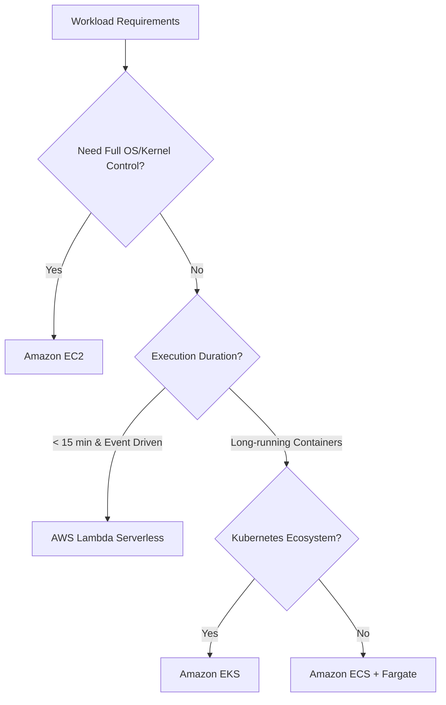

# ☁️ Amazon Web Services (AWS) Interview Master Guide (50 Questions)

> A comprehensive, production-grade guide containing **50 in-depth interview questions, cloud architecture diagrams, security patterns, serverless paradigms, and real-world infrastructure strategies** for Cloud, DevOps, and Full-Stack Engineering interviews.

---

## 📑 Table of Contents

- [1. Cloud Fundamentals & Global Infrastructure (Q1–Q6)](#1-cloud-fundamentals--global-infrastructure)
- [2. IAM, Security & Secret Management (Q7–Q14)](#2-iam-security--secret-management)
- [3. VPC, Subnets & AWS Networking (Q15–Q22)](#3-vpc-subnets--aws-networking)
- [4. Compute: EC2, ECS, EKS & Lambda (Q23–Q30)](#4-compute-ec2-ecs-eks--lambda)
- [5. Storage & Databases: S3, RDS, DynamoDB, ElastiCache (Q31–Q38)](#5-storage--databases-s3-rds-dynamodb-elasticache)
- [6. Load Balancing, CDN & DNS: ALB, CloudFront, Route 53 (Q39–Q44)](#6-load-balancing-cdn--dns-alb-cloudfront-route-53)
- [7. Messaging, Observability & Disaster Recovery: SQS, SNS, CloudWatch (Q45–Q50)](#7-messaging-observability--disaster-recovery-sqs-sns-cloudwatch)

---

# 🚀 50 In-Depth Interview Questions & Answers

---

### 1. Cloud Fundamentals & Global Infrastructure

#### 1. What are Regions, Availability Zones (AZs), and Edge Locations in AWS?
- **Region**: A physical geographic location in the world with multiple isolated, physically separated data centers (e.g., `us-east-1` N. Virginia, `ap-south-1` Mumbai).
- **Availability Zone (AZ)**: One or more discrete data centers with redundant power, networking, and connectivity within a Region (e.g., `us-east-1a`, `us-east-1b`). They are connected via ultra-low-latency private fiber links.
- **Edge Location / Point of Presence (PoP)**: Hundreds of global edge sites used by **CloudFront (CDN)** and **Route 53 (DNS)** to cache static/dynamic content close to end users.

---

#### 2. What are the core differences between IaaS, PaaS, and SaaS?
- **IaaS (Infrastructure as a Service)**: AWS manages physical hardware and virtualization; you manage OS, runtime, patching, and data (e.g., AWS EC2, EBS, VPC).
- **PaaS (Platform as a Service)**: AWS manages OS, patching, and runtime; you manage application code and data (e.g., AWS Elastic Beanstalk, ECS Fargate, RDS).
- **SaaS (Software as a Service)**: AWS manages the complete software stack (e.g., AWS WorkMail, QuickSight).

---

#### 3. What is the AWS Shared Responsibility Model?
- **Security OF the Cloud (AWS's Responsibility)**: Physical data centers, server hardware, hypervisors, global network infrastructure, and managed service software patches.
- **Security IN the Cloud (Customer's Responsibility)**: IAM credentials, user access control, data encryption (at rest and in transit), firewall rules (Security Groups & NACLs), OS patching (on EC2), and application code security.

---

#### 4. How do you design for High Availability (HA) and Fault Tolerance in AWS?
1. **Multi-AZ Architecture**: Deploy compute instances and load balancers across at least 2 or 3 Availability Zones.
2. **Auto Scaling Groups (ASG)**: Automatically replace failed EC2 instances and scale capacity horizontally based on traffic metrics.
3. **Multi-AZ Managed Databases**: Use AWS RDS with synchronous Multi-AZ standby replication for automated 60-second failovers.
4. **Stateless Compute**: Store user session state in distributed caches (AWS ElastiCache Redis) rather than local server memory.

---

#### 5. What is the AWS Well-Architected Framework (6 Pillars)?
1. **Operational Excellence**: Infrastructure as code (Terraform/CloudFormation), continuous observability.
2. **Security**: Least privilege access (IAM), encryption everywhere, defense in depth.
3. **Reliability**: Multi-AZ redundancy, automated recovery, failure testing.
4. **Performance Efficiency**: Right-sizing resources, serverless, caching at edge (CloudFront/ElastiCache).
5. **Cost Optimization**: Reserved/Savings Plans, Spot instances for batch, S3 lifecycle rules.
6. **Sustainability**: Reducing compute footprints and optimizing resource utilization.

---

#### 6. What are the different AWS EC2 Pricing Models?
- **On-Demand**: Pay by the second with zero upfront commitments. Ideal for unpredictable or short-term workloads.
- **Savings Plans / Reserved Instances (RI)**: Up to 72% discount in exchange for a 1-year or 3-year commitment of steady usage.
- **Spot Instances**: Up to 90% discount on unused AWS spare capacity. AWS can reclaim instances with a 2-minute warning. Ideal for stateless batch processing, CI/CD runners, and fault-tolerant workloads.
- **Dedicated Hosts**: Dedicated physical physical server for compliance, licensing, or regulatory requirements.

---

### 2. IAM, Security & Secret Management

#### 7. What is the difference between IAM Users, Groups, Roles, and Policies?
- **IAM User**: An identity assigned to an individual person or service with long-term credentials (password, access key).
- **IAM Group**: A collection of IAM users used to apply policies to multiple users at once.
- **IAM Role**: An identity with specific permissions that is **assumed** temporarily by an entity (EC2 instance, Lambda function, GitHub Actions pipeline, or cross-account user). Issues short-term temporary STS tokens.
- **IAM Policy**: A JSON document formally defining allowed or denied actions (`Effect`, `Action`, `Resource`, `Condition`).

---

#### 8. What is the Principle of Least Privilege in AWS IAM?
Every identity (user, service, or machine) must be granted **only the minimum set of permissions necessary** to perform its intended task, and nothing more.
- *Anti-Pattern*: Assigning `AdministratorAccess` or `*:*` wildcard permissions.
- *Best Practice*: Explicitly specify exact actions (e.g., `s3:GetObject`) on exact ARN resources (e.g., `arn:aws:s3:::my-bucket/*`).

---

#### 9. Write an IAM Policy granting Read-Only access to a specific S3 bucket.

```json
{
  "Version": "2012-10-17",
  "Statement": [
    {
      "Sid": "AllowBucketList",
      "Effect": "Allow",
      "Action": ["s3:ListBucket"],
      "Resource": ["arn:aws:s3:::my-company-assets"]
    },
    {
      "Sid": "AllowObjectRead",
      "Effect": "Allow",
      "Action": ["s3:GetObject", "s3:GetObjectVersion"],
      "Resource": ["arn:aws:s3:::my-company-assets/*"]
    }
  ]
}
```

---

#### 10. How does IAM Policy Evaluation logic work with Explicit Deny vs Explicit Allow?
1. By default, all requests are **implicitly denied**.
2. An **explicit allow** overrides the default implicit deny.
3. An **explicit deny** (`"Effect": "Deny"`) **ALWAYS overrides any explicit allow**, regardless of policy attachment order or hierarchy.

---

#### 11. Why should you NEVER hardcode AWS Access Keys (`AKIA...`) on EC2 instances or Lambda functions?
Hardcoded credentials are prone to accidental Git commits, credential theft, and lack automatic key rotation.
- **Solution**: Attach an **IAM Instance Profile / IAM Role** directly to the EC2 instance or Lambda execution role. The AWS SDK automatically requests and rotates temporary credentials from the AWS Instance Metadata Service (IMDSv2) at `http://169.254.169.254/latest/meta-data/`.

---

#### 12. What is AWS KMS (Key Management Service) and Envelope Encryption?
- **AWS KMS**: A managed service for creating and controlling cryptographic encryption keys (Customer Managed Keys / CMKs).
- **Envelope Encryption**: KMS generates a plaintext **Data Encryption Key (DEK)** and an encrypted DEK. The application uses the plaintext DEK to encrypt large datasets locally, then deletes the plaintext DEK from memory and stores the encrypted DEK alongside the ciphertext.

---

#### 13. AWS Secrets Manager vs AWS Systems Manager (SSM) Parameter Store.
- **SSM Parameter Store**: Lightweight, hierarchical key-value storage for config strings and secrets. Free tier available for standard parameters.
- **Secrets Manager**: Specialized for enterprise secrets. Offers **automated database credential rotation** (integrates with RDS/Aurora via Lambda), fine-grained KMS encryption, and cross-account secret sharing.

---

#### 14. What is AWS WAF and AWS Shield?
- **AWS WAF (Web Application Firewall)**: Layer 7 firewall protecting web applications and APIs behind ALBs, API Gateway, or CloudFront from common web exploits (SQL injection, XSS, rate limiting per IP).
- **AWS Shield**: Managed DDoS protection service.
  - *Shield Standard*: Free, automatic Layer 3/4 SYN flood and UDP reflection protection.
  - *Shield Advanced*: 24/7 DDoS Response Team (DRT), financial protection against cost spikes during attacks.

---

### 3. VPC, Subnets & AWS Networking

#### 15. What is an Amazon VPC (Virtual Private Cloud)?
A VPC is a logically isolated virtual software-defined network dedicated to your AWS account within a specific Region. You have full control over IP address ranges (CIDR blocks, e.g., `10.0.0.0/16`), subnets, routing tables, and network gateways.

---

#### 16. What is the difference between a Public Subnet and a Private Subnet?
- **Public Subnet**: Its routing table has a direct route (`0.0.0.0/0`) pointing to an **Internet Gateway (IGW)**. Resources can be assigned public IPs and can be reached directly from the internet (e.g., ALBs, NAT Gateways).
- **Private Subnet**: Has **no direct route** to an IGW. Instances have private IPs only and cannot be accessed from the outside internet (e.g., backend application servers, databases).

```
Public Subnet Route Table:
Destination: 0.0.0.0/0  --> Target: igw-0123456789abcdef0

Private Subnet Route Table:
Destination: 0.0.0.0/0  --> Target: nat-0123456789abcdef0 (NAT Gateway)
```

---

#### 17. How does an EC2 instance in a Private Subnet access the internet to download OS updates?
Via a **NAT Gateway (Network Address Translation Gateway)** placed in a **Public Subnet**.
1. Private EC2 sends outbound traffic to its local route table (`0.0.0.0/0 -> NAT Gateway`).
2. NAT Gateway translates the private IP to its own Elastic (Public) IP and forwards the packet to the Internet Gateway.
3. Responses flow back through the NAT Gateway, which translates back to the private IP. Inbound unsolicited traffic from the internet is completely blocked.

---

#### 18. What are the differences between Security Groups and Network ACLs (NACLs)?

| Feature | Security Group (SG) | Network ACL (NACL) |
| :--- | :--- | :--- |
| **Operates At** | Instance / ENI level | Subnet level |
| **State** | **Stateful** (Return traffic automatically allowed) | **Stateless** (Must explicitly define inbound & outbound rules) |
| **Rules Support** | **Allow** rules only | **Allow** AND **Deny** rules (evaluated in numbered order) |
| **Default Behavior**| All inbound blocked, all outbound allowed | Default NACL allows all; custom NACL denies all |

---

#### 19. What is VPC Peering vs AWS Transit Gateway?
- **VPC Peering**: A direct 1-to-1 network connection between two VPCs. Non-transitive (VPC A peering with B and B with C does *not* allow A to talk to C). Managing `N` VPCs requires $O(N^2)$ peering connections.
- **AWS Transit Gateway (TGW)**: A centralized regional cloud hub (hub-and-spoke model) connecting thousands of VPCs, on-premises data centers (VPN/Direct Connect), and accounts through a single gateway.

---

#### 20. What is a VPC Endpoint (Gateway Endpoint vs Interface Endpoint / PrivateLink)?
Allows private subnets to connect securely to AWS services without traversing the public internet or using a NAT Gateway.
- **Gateway Endpoint**: Free route table entry for **S3** and **DynamoDB**.
- **Interface Endpoint (AWS PrivateLink)**: Provisions an Elastic Network Interface (ENI) with a private IP in your subnet for services like SQS, SNS, Secrets Manager, or custom microservices.

---

#### 21. How do you securely connect an On-Premises Data Center to an AWS VPC?
1. **AWS Site-to-Site VPN**: IPsec encrypted tunnel over the public internet (quick to establish, throughput up to 1.25 Gbps per tunnel).
2. **AWS Direct Connect (DX)**: Dedicated physical 1 Gbps, 10 Gbps, or 100 Gbps private fiber line bypassing the public internet (consistent low latency, high bandwidth, SLA-backed).

---

#### 22. What is CIDR notation and how many usable IPs exist in a `/24` AWS subnet?
- CIDR (Classless Inter-Domain Routing): e.g., `10.0.1.0/24` represents $2^{(32-24)} = 256$ IP addresses.
- **AWS Usable IPs**: AWS reserves **5 IP addresses** in every subnet (Network Address `.0`, VPC Router `.1`, CoreDNS `.2`, Future AWS Use `.3`, and Broadcast Address `.255`).
- Usable IPs in `/24` = $256 - 5 = \mathbf{251}$ usable addresses.

---

### 4. Compute: EC2, ECS, EKS & Lambda

#### 23. What are the key compute options in AWS and when should you choose each?



---

#### 24. AWS ECS (Elastic Container Service): EC2 Launch Type vs Fargate Launch Type.
- **EC2 Launch Type**: You manage the underlying EC2 cluster instances (patching, OS scaling, reserving instances for cost savings).
- **AWS Fargate (Serverless Containers)**: AWS manages the server infrastructure entirely. You specify CPU and RAM requirements per container task, paying only for the exact seconds the container runs.

---

#### 25. What is Amazon EKS (Elastic Kubernetes Service)?
EKS is a managed Kubernetes service where AWS operates, scales, and backs up the multi-AZ Kubernetes control plane (`etcd`, `kube-apiserver`). You attach worker nodes via managed node groups or serverless Fargate profiles.

---

#### 26. What is AWS Lambda and what are its core architectural limits?
AWS Lambda is an event-driven serverless compute service executing code in response to triggers (HTTP requests via API Gateway, S3 uploads, SQS messages, DynamoDB streams).
- **Execution Timeout**: Max 15 minutes (900 seconds).
- **Memory Allocation**: 128 MB to 10,240 MB (10 GB) with proportional vCPU allocation.
- **Ephemeral Storage (`/tmp`)**: 512 MB to 10 GB.
- **Payload Limit**: 6 MB (Synchronous invocation) / 256 KB (Asynchronous).

---

#### 27. What is a "Cold Start" in AWS Lambda and how do you minimize it?
When a Lambda function is invoked for the first time or after scaling up, AWS spins up a new microVM sandbox execution environment, downloads code, and initializes dependencies.
- **Mitigations**:
  1. **Provisioned Concurrency**: Keeps pre-warmed execution environments initialized and ready to respond in single-digit milliseconds.
  2. **Optimize Package Size**: Tree-shake imports, minify bundles, and use lightweight runtimes (Node.js, Go, Rust).
  3. **Initialize DB Connections Outside the Handler**: Reuse global database connection pools across warm invocations.

```javascript
// Database pool initialized in GLOBAL scope (executed once during cold start, reused in warm invocations)
const { Pool } = require('pg');
const pool = new Pool({ connectionString: process.env.DATABASE_URL });

exports.handler = async (event) => {
  const client = await pool.connect();
  const res = await client.query('SELECT * FROM users WHERE id = $1', [event.userId]);
  client.release();
  return { statusCode: 200, body: JSON.stringify(res.rows[0]) };
};
```

---

#### 28. What is an EC2 Auto Scaling Group (ASG) and dynamic scaling policies?
An ASG automatically adjusts the number of EC2 instances to maintain optimal application performance:
- **Target Tracking Scaling**: Maintains a specific metric target (e.g., "keep average ASG CPU utilization at 60%").
- **Step / Simple Scaling**: Scales in steps (e.g., if CPU > 80%, add 2 instances; if CPU > 90%, add 4 instances).
- **Scheduled Scaling**: Pre-scales instances for predictable business events (e.g., Black Friday 9:00 AM).

---

#### 29. What is AWS Elastic Beanstalk?
A high-level PaaS offering that allows developers to upload application code (Node, Python, Java, Docker), while Beanstalk automatically handles provisioning, load balancing, auto-scaling, and health monitoring.

---

#### 30. How do you deploy Docker containers to AWS Lambda?
Lambda supports container images up to 10 GB packaged as OCI-compliant images stored in Amazon ECR. The image must implement the **Lambda Runtime API** or use AWS-provided base images (`public.ecr.aws/lambda/nodejs:20`).

---

### 5. Storage & Databases: S3, RDS, DynamoDB, ElastiCache

#### 31. What is Amazon S3 and what are its primary Storage Classes?
Amazon S3 (Simple Storage Service) is an object store offering 99.999999999% (11 9s) of data durability.
- **S3 Standard**: High throughput, low latency for frequently accessed data.
- **S3 Intelligent-Tiering**: Automatically moves objects between frequent, infrequent, and archive tiers based on access patterns without operational overhead.
- **S3 Standard-IA (Infrequent Access)**: Cheaper storage cost, but incurs per-GB retrieval fees (ideal for monthly reports).
- **S3 Glacier Flexible / Deep Archive**: Extremely low-cost long-term archival storage (retrieval takes minutes to hours).

---

#### 32. How do S3 Pre-Signed URLs work, and why are they critical for full-stack apps?
Pre-Signed URLs grant temporary, time-limited read/write access to a specific S3 object using the IAM credentials of the generating server.
- **Benefit**: Allows web/mobile clients to upload large media files (videos, images) **directly to S3**, bypassing the backend API server and preventing backend network/CPU bottlenecks.

---

#### 33. What is the difference between S3 Strong Consistency and Eventual Consistency?
Since late 2020, Amazon S3 provides **Strong Read-After-Write Consistency** for `PUT` and `DELETE` requests of objects in all AWS regions. Immediately after a new object is uploaded, a read (`GET`) will return the newest version.

---

#### 34. Amazon RDS: Multi-AZ Deployment vs Read Replicas.

| Feature | Multi-AZ Deployment | Read Replicas |
| :--- | :--- | :--- |
| **Purpose** | **High Availability & Disaster Recovery** | **Read Scalability & Performance** |
| **Replication** | **Synchronous** to a standby instance in another AZ | **Asynchronous** (subject to minor replication lag) |
| **Database Engine** | Standby instance is passive (cannot serve reads) | Read Replicas are active and serve read queries |
| **Failover** | Automated DNS failover in 60 seconds if primary fails | Manual or automated promotion to new standalone primary |

---

#### 35. What is Amazon Aurora and how does its storage architecture differ from standard RDS?
Aurora is AWS's cloud-native relational database engine (compatible with PostgreSQL and MySQL).
- **Architecture**: Decouples compute from storage. Aurora replicates a single virtual 10GB-increment storage volume **6 times across 3 Availability Zones**.
- **Performance**: Up to 5x throughput of standard MySQL and 3x standard PostgreSQL, with millisecond replication lag across up to 15 read replicas.
- **Aurora Serverless v2**: Automatically scales compute capacity up and down in fractional ACUs (Aurora Capacity Units) in fractions of a second.

---

#### 36. What is Amazon DynamoDB and how does it achieve single-digit millisecond latency?
DynamoDB is a fully managed, serverless, NoSQL key-value and document database.
- **Partitioning**: Uses a **Partition Key (PK)** to distribute data horizontally across storage partitions using consistent hashing.
- **Global Secondary Indexes (GSI)**: Enables querying attributes other than the primary partition key with asynchronous replication.
- **DynamoDB Accelerator (DAX)**: An in-memory microsecond cache cluster directly in front of DynamoDB.

---

#### 37. What is Amazon ElastiCache (Redis vs Memcached)?
- **ElastiCache Redis**: In-memory data store supporting advanced data structures (sorted sets, hashes, pub/sub, geospatial), data persistence, Multi-AZ clustering with auto-failover, and read replicas.
- **ElastiCache Memcached**: Simple multi-threaded in-memory key-value caching (no persistence, no complex data types).

---

#### 38. How do you implement database migration to AWS with zero downtime?
Use **AWS DMS (Database Migration Service)** combined with AWS Schema Conversion Tool (SCT). DMS captures live Change Data Capture (CDC) logs from the source database, continuously streaming updates to the AWS RDS/Aurora target until cutover.

---

### 6. Load Balancing, CDN & DNS: ALB, CloudFront, Route 53

#### 39. What are the differences between ALB, NLB, and CLB?
- **Application Load Balancer (ALB)**: Layer 7 (HTTP/HTTPS/gRPC/WebSockets). Supports host-based routing (`api.domain.com`), path-based routing (`/users`), and redirects.
- **Network Load Balancer (NLB)**: Layer 4 (TCP/UDP/TLS). Ultra-high throughput (millions of RPS), sub-millisecond latency, and provides a static Elastic IP address.
- **Classic Load Balancer (CLB)**: Legacy Layer 4/7 load balancer (deprecated for new architectures).

---

#### 40. How does Amazon CloudFront CDN work, and what is Cache Invalidation?
CloudFront caches static assets (JS, CSS, images, video) and dynamic API responses at 400+ Edge Locations worldwide.
- When an updated file is deployed, edge caches can be refreshed immediately using a **Cache Invalidation**:
```bash
aws cloudfront create-invalidation --distribution-id E12345EXAMPLE --paths "/*"
```
*(Best practice for static web apps: Use content-hashed filenames like `main.a8b1c2.js` and set `Cache-Control: max-age=31536000, immutable` to eliminate the need for invalidations).*

---

#### 41. What are Amazon Route 53 Routing Policies?
1. **Simple Routing**: Standard 1-to-1 DNS record mapping.
2. **Weighted Routing**: Distributes traffic across resources by percentage (ideal for A/B testing).
3. **Latency-Based Routing**: Directs users to the AWS Region that provides the lowest network latency.
4. **Geolocation / Geoproximity Routing**: Routes traffic based on the geographic location of the user (e.g., EU users directed to EU data centers for GDPR compliance).
5. **Failover Routing**: Active-Passive health-check-driven failover to a backup disaster recovery site.
6. **Multi-Value Answer**: Returns multiple healthy IP records for client-side load balancing.

---

#### 42. What is an Alias Record in Route 53 and why is it preferred over CNAME?
- Standard DNS RFCs prohibit CNAME records on the apex/zone apex (`example.com`).
- **Route 53 Alias Record**: An AWS-specific extension that maps the apex domain directly to AWS resources (ALBs, CloudFront distributions, S3 buckets) with automated internal IP tracking and zero query cost.

---

#### 43. What is CloudFront Origin Shield and Lambda@Edge / CloudFront Functions?
- **Origin Shield**: An additional centralized caching layer placed between edge locations and your origin server to minimize origin load.
- **CloudFront Functions**: Ultra-fast, lightweight JavaScript execution at the edge (sub-millisecond) for URL rewrites, header modifications, and JWT validation.
- **Lambda@Edge**: Full Node.js/Python serverless execution at edge locations for complex computations before hitting origin servers.

---

#### 44. How do you configure SSL/TLS certificates in AWS with automated renewal?
Use **AWS Certificate Manager (ACM)**. ACM issues free public SSL/TLS certificates that can be bound to CloudFront, ALBs, or API Gateways with automated DNS validation and zero-touch auto-renewal via Route 53.

---

### 7. Messaging, Observability & Disaster Recovery

#### 45. Amazon SQS: Standard Queue vs FIFO Queue.

| Feature | SQS Standard Queue | SQS FIFO Queue (`.fifo`) |
| :--- | :--- | :--- |
| **Order Guarantee** | Best-effort ordering | **Strict First-In-First-Out** ordering |
| **Delivery Guarantee** | **At-least-once** delivery (rare duplicates possible) | **Exactly-once** processing (via Deduplication ID) |
| **Throughput** | Nearly unlimited messages/sec | 300 msg/sec (up to 3,000 with batching / high throughput mode) |
| **Message Grouping** | N/A | Supported via `MessageGroupId` |

---

#### 46. What is SQS Dead Letter Queue (DLQ) and Visibility Timeout?
- **Visibility Timeout**: The period of time (default 30s) during which a message is hidden from other workers after being read by a consumer. If the consumer crashes before calling `DeleteMessage`, the message becomes visible again for another worker.
- **Dead Letter Queue (DLQ)**: A secondary queue where messages are automatically routed after failing to process `maxReceiveCount` times, preventing poison-pill messages from clogging the main queue.

---

#### 47. SQS vs SNS vs EventBridge: What are the differences?
- **Amazon SQS**: Point-to-point **pull-based message queue** for decoupling asynchronous background workloads.
- **Amazon SNS**: Push-based **Pub/Sub topic** for fanning out a single event to multiple subscribers (SQS queues, Lambda, HTTP endpoints, SMS, email).
- **Amazon EventBridge**: Serverless **event bus** routing structured JSON events between AWS services, SaaS apps (Stripe, Datadog), and custom microservices with advanced declarative content filtering rules.

---

#### 48. What is Amazon CloudWatch (Metrics, Logs, Alarms)?
- **CloudWatch Metrics**: Collects real-time performance data (CPU, disk I/O, network) at 1-minute or 1-second intervals.
- **CloudWatch Logs**: Centralized log aggregation and query engine (CloudWatch Logs Insights).
- **CloudWatch Alarms**: Triggers automated actions (SNS alerts, Auto Scaling triggers, EC2 reboot) when a metric breaches a threshold (e.g. `ALB 5XX Errors > 1% for 3 min`).

---

#### 49. What is AWS X-Ray and Distributed Tracing?
AWS X-Ray traces user requests as they travel across multi-tier microservice architectures (API Gateway -> Lambda -> SQS -> ECS -> DynamoDB). It generates a live service map and pinpoints downstream latency bottlenecks and HTTP 5xx failures.

---

#### 50. What are the four AWS Disaster Recovery (DR) Strategies?

```
Lowest Cost / Highest RTO & RPO -------------------> Highest Cost / Lowest RTO & RPO
[Backup & Restore]  -->  [Pilot Light]  -->  [Warm Standby]  -->  [Multi-Site Active-Active]
```

1. **Backup & Restore**: Data backed up to S3 in another region. Recovery takes hours/days (High RTO/RPO, Lowest Cost).
2. **Pilot Light**: Core database is continuously replicated to the DR region, but compute servers are kept off or minimal. Spun up only during a disaster.
3. **Warm Standby**: A scaled-down, functional copy of the entire infrastructure runs continuously in the secondary region. Can be scaled up instantly during an outage.
4. **Multi-Region Active-Active**: Full production traffic is served concurrently from 2+ AWS regions via Route 53 latency routing (Zero RTO, Near-Zero RPO, Highest Cost).
