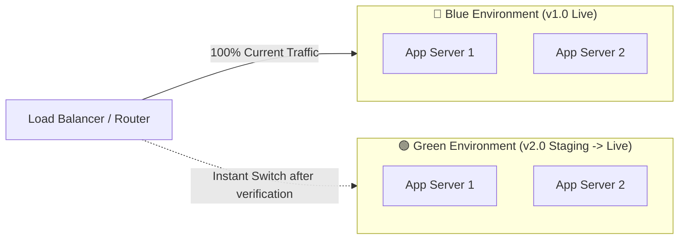
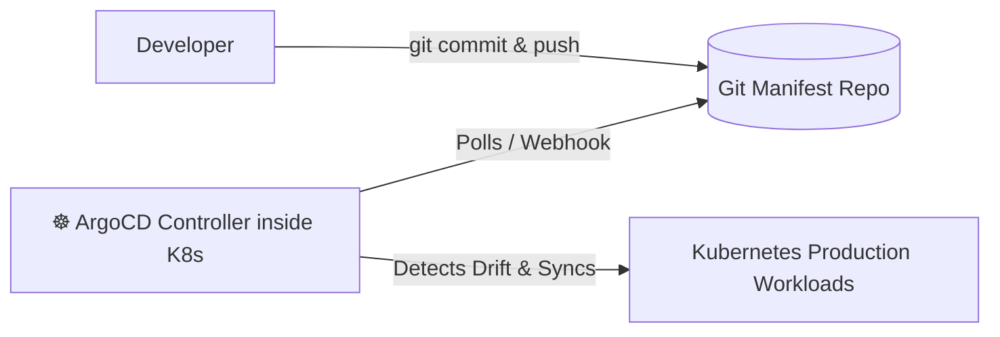

# 🚀 Deployment Strategies, CI/CD & DevOps Interview Master Guide (50 Questions)

> A production-grade, end-to-end guide containing **50 in-depth interview questions, deployment strategy comparisons, GitHub Actions CI/CD workflows, GitOps pipelines, Terraform IaC patterns, and zero-downtime release architectures** for Senior DevOps, SRE, and Full-Stack Engineering interviews.

---

## 📑 Table of Contents

- [1. Deployment Strategies & Release Engineering (Q1–Q10)](#1-deployment-strategies--release-engineering)
- [2. Continuous Integration & CI Pipelines (Q11–Q18)](#2-continuous-integration--ci-pipelines)
- [3. Continuous Delivery, CD & Automation (Q19–Q25)](#3-continuous-delivery-cd--automation)
- [4. GitOps, ArgoCD & Infrastructure as Code (Q26–Q33)](#4-gitops-argocd--infrastructure-as-code)
- [5. Database Migrations in Zero-Downtime Releases (Q34–Q38)](#5-database-migrations-in-zero-downtime-releases)
- [6. Secrets, Environment & Artifact Management (Q39–Q44)](#6-secrets-environment--artifact-management)
- [7. Rollbacks, Observability & Reliability Engineering (Q45–Q50)](#7-rollbacks-observability--reliability-engineering)

---

# 🚀 50 In-Depth Interview Questions & Answers

---

### 1. Deployment Strategies & Release Engineering

#### 1. What are the primary deployment strategies used in modern cloud-native systems?
1. **Recreate**: Shuts down old version completely before starting the new version (downtime guaranteed).
2. **Rolling Update**: Incrementally replaces instances of the old version with the new version (zero downtime, no extra cost).
3. **Blue-Green Deployment**: Spins up an identical new environment (Green), tests it, then switches the router/load balancer traffic instantly from Blue to Green.
4. **Canary Deployment**: Routes a small percentage of user traffic (e.g. 5%) to the new version, monitors error rates and metrics, then gradually rolls it out to 100%.
5. **A/B Testing**: Routes traffic based on user attributes (geography, user ID, cookies) to test business feature impact.
6. **Shadow / Dark Launch**: Duplicates real production incoming traffic to the new version without returning its responses to end users.

---

#### 2. Deep Dive: How does Blue-Green Deployment work, and what are its pros & cons?



- **Workflow**:
  1. Production runs on **Blue** (v1.0).
  2. Deploy new release (v2.0) to completely isolated **Green** environment.
  3. Run automated smoke tests, integration tests, and performance checks against Green.
  4. Update Load Balancer / Route 53 DNS target to point to Green.
  5. If an anomaly occurs, switch back to Blue in seconds.
- **Pros**: Zero downtime, instant near-zero-second rollback capability.
- **Cons**: Doubles infrastructure cost during deployment; requires strict backwards-compatible database schemas.

---

#### 3. Deep Dive: How does Canary Deployment work?
Canary deployments minimize the blast radius of potential bugs by exposing new releases to a subset of users before full rollout.
- **Phases**:
  1. Route 95% of traffic to v1.0 (Stable) and 5% to v2.0 (Canary).
  2. Automated analysis tools (e.g. Argo Rollouts, Prometheus, Datadog) monitor:
     - HTTP 5xx error rate.
     - Latency percentiles ($P_{95}$, $P_{99}$).
     - Unhandled exceptions.
  3. If metrics remain healthy over 15 minutes, increase traffic: $5\% \to 25\% \to 50\% \to 100\%$.
  4. If an alarm breaches, traffic immediately reverts to 100% v1.0.

---

#### 4. Compare Rolling Update vs Blue-Green vs Canary Deployment.

| Metric | Rolling Update | Blue-Green | Canary |
| :--- | :--- | :--- | :--- |
| **Downtime** | Zero | Zero | Zero |
| **Rollback Speed** | Slow (requires rolling back pods/servers) | **Instant** (single router switch) | Fast (traffic reroute) |
| **Cost / Overhead** | Low (only small surge capacity) | High (2x full capacity during release) | Low (small percentage surge) |
| **Mixed Versions** | Yes (both versions run concurrently) | No (clean cutover) | Yes (deliberately split) |
| **Complexity** | Low (built into K8s/ECS) | Medium (infrastructure provisioning) | High (requires smart routing & metrics) |

---

#### 5. What is a "Dark Launch" or "Shadow Deployment"?
Production traffic is mirrored (cloned) at the load balancer or service mesh level (e.g. Envoy traffic mirroring) and sent asynchronously to the new release.
- The responses from the shadow service are discarded and not returned to users.
- **Benefit**: Stress tests performance, database load, and algorithm outputs against real-world production concurrency without risking user experience.

---

#### 6. What is the difference between Continuous Integration (CI), Continuous Delivery (CD), and Continuous Deployment?
- **Continuous Integration (CI)**: Developers merge code frequently to the main branch; automated pipelines build, lint, and run unit/integration tests on every commit.
- **Continuous Delivery (CD)**: Automatically builds deployable artifacts and stages them for release; deployment to production requires a **manual one-click human approval**.
- **Continuous Deployment**: Every commit that passes the automated CI/CD test suite is **automatically released directly to production** with zero human intervention.

---

#### 7. What is Feature Flagging (Feature Toggles) and how does it decouple Deployment from Release?
- **Deployment**: The technical act of installing new code on production servers.
- **Release**: The business act of making a feature visible to users.
- **Feature Flags (LaunchDarkly, Unleash)**: Wrapping code in runtime boolean flags evaluated in real time:
```javascript
if (await featureFlags.isEnabled('new-checkout-v2', user)) {
  return renderNewCheckout();
} else {
  return renderLegacyCheckout();
}
```
- **Benefits**: Merge code to trunk daily; instantly toggle features on/off or target specific user beta rings without redeploying code.

---

#### 8. What is Trunk-Based Development vs GitFlow?
- **GitFlow**: Heavy branch-based model with long-lived branches (`develop`, `release`, `hotfix`, `feature`). Prone to painful merge conflicts ("merge hell") and delayed releases.
- **Trunk-Based Development**: Modern DevOps best practice. Developers commit small, frequent changes directly to a single `main` branch (trunk) daily, using feature flags to hide incomplete work. Enables rapid continuous integration and fast delivery.

---

#### 9. What are Semantic Versioning (SemVer) and Git Tagging in release workflows?
Format: **`MAJOR.MINOR.PATCH`** (e.g., `v2.4.1`):
- **`MAJOR`**: Incompatible API breaking changes.
- **`MINOR`**: Backwards-compatible new features.
- **`PATCH`**: Backwards-compatible bug fixes.
- Git tags (`git tag -a v2.4.1 -m "Release 2.4.1"`) trigger automated release pipelines and changelog generation.

---

#### 10. What is an Immutable Infrastructure pattern?
Instead of modifying, SSHing into, or patching running production servers in place (**mutable servers**), servers are **never updated**.
- When an update or patch is needed, new container images or AMIs are built from scratch, tested, deployed, and the old servers are terminated.
- **Benefit**: Completely eliminates configuration drift between environments.

---

### 2. Continuous Integration & CI Pipelines

#### 11. What are the key stages of an enterprise CI pipeline?
1. **Linting & Code Formatting**: ESLint, Prettier, Black, GolangCI-Lint.
2. **Static Application Security Testing (SAST)**: SonarQube, Snyk, Semgrep.
3. **Automated Unit & Integration Testing**: Jest, PyTest, JUnit with code coverage reports.
4. **Secret Scanning**: Gitleaks, TruffleHog (prevents committing AWS keys or tokens).
5. **Artifact / Container Build**: Docker multi-stage build.
6. **Container Vulnerability Scan**: Trivy, Grype for CVE scanning.
7. **Publish Artifact**: Push image to Amazon ECR / Docker Hub with unique commit SHA tag.

---

#### 12. Write a production GitHub Actions CI workflow for a Node/TypeScript app.

```yaml
name: CI Pipeline

on:
  push:
    branches: [ main ]
  pull_request:
    branches: [ main ]

jobs:
  test-and-build:
    runs-on: ubuntu-latest

    steps:
      - name: Checkout Source Code
        uses: actions/checkout@v4

      - name: Setup Node.js 20
        uses: actions/setup-node@v4
        with:
          node-version: 20
          cache: 'npm'

      - name: Install Dependencies
        run: npm ci

      - name: Run Linter & Type Check
        run: |
          npm run lint
          npx tsc --noEmit

      - name: Run Unit Tests with Coverage
        run: npm test -- --coverage

      - name: Security Scan (Trivy)
        uses: aquasecurity/trivy-action@master
        with:
          scan-type: 'fs'
          severity: 'CRITICAL,HIGH'

      - name: Set up Docker Buildx
        uses: docker/setup-buildx-action@v3

      - name: Build Docker Image (Verify buildability)
        uses: docker/build-push-action@v5
        with:
          context: .
          push: false
          tags: myapp:${{ github.sha }}
```

---

#### 13. How do you optimize CI pipeline speed to run under 3 minutes?
1. **Dependency Caching**: Cache `~/.npm`, `~/.m2`, or `node_modules` across runs using `actions/cache`.
2. **Parallel Job Matrix**: Run linting, backend tests, and frontend tests concurrently across different runners.
3. **Docker Layer Caching**: Use GitHub Actions Cache backend (`type=gha`) for Docker Buildx layers.
4. **Sharding Tests**: Split test suites across 4–8 runners concurrently (e.g. Jest `--shard=1/4`).
5. **Fail-Fast**: Run fast checks (linting/types) before heavy end-to-end integration tests.

---

#### 14. What are Self-Hosted Runners vs Cloud Runners (GitHub/GitLab)?
- **Cloud-Managed Runners**: Ephemeral VMs managed by GitHub/GitLab. Zero maintenance, but have concurrency limits and per-minute costs.
- **Self-Hosted Runners**: VMs or Kubernetes pods (e.g., Actions Runner Controller - ARC) running inside your own AWS VPC.
  - *Benefits*: Access to private AWS resources without public ingress; customizable high-spec compute/GPUs; cost savings for high-frequency CI pipelines.

---

#### 15. How do you prevent sensitive secrets from leaking in CI logs?
- Use repository / organization Secret stores (`${{ secrets.AWS_SECRET_KEY }}`).
- CI systems automatically mask registered secrets in logs.
- Never `echo` interpolated variables in shell scripts; pass them as environment variables instead:
```yaml
# ❌ BAD: Can leak if variable contains special characters
run: ./deploy.sh ${{ secrets.API_TOKEN }}

# ✅ GOOD: Environment variable injection
env:
  API_TOKEN: ${{ secrets.API_TOKEN }}
run: ./deploy.sh
```

---

#### 16. What is Ephemeral Pull Request Environments (Preview Environments)?
On every pull request, the CI/CD pipeline automatically spins up a dedicated, isolated staging environment with a unique URL (e.g., `pr-142.preview.company.com`) using Kubernetes or AWS ECS.
- Enables product managers and QA to test features before merging to `main`.
- Environment is automatically torn down when the PR is merged or closed.

---

#### 17. What is Static Code Analysis vs Dynamic Application Security Testing (DAST)?
- **SAST (Static Analysis)**: Inspects source code without executing it (finds SQL injection risks, insecure crypto, code smells).
- **DAST (Dynamic Analysis)**: Tests the running application from the outside (like an attacker), sending malicious HTTP payloads (e.g. OWASP ZAP) to find runtime vulnerabilities.

---

#### 18. What is a Monorepo CI strategy and tooling (Nx, Turborepo)?
In a monorepo containing multiple apps and packages, rebuilding every application on every commit is too slow.
- **Turborepo / Nx**: Generates a dependency graph and calculates file checksums.
- **Affected Builds**: Runs tests and builds **only for the packages and apps affected** by the changed files in that specific commit.

---

### 3. Continuous Delivery & Automation

#### 19. How do you implement Zero-Downtime Deployments with AWS Application Load Balancers (ALBs)?
1. Attach Target Group with Deregistration Delay (Connection Draining).
2. Set **Deregistration Delay** to 30–60 seconds.
3. When an instance is replaced, ALB stops sending new requests to the old target and waits 30 seconds for in-flight HTTP requests to finish cleanly before terminating the instance.

---

#### 20. Write a GitHub Actions Workflow deploying a Docker image to AWS ECR and ECS.

```yaml
name: Deploy to Amazon ECS

on:
  push:
    branches: [ main ]

jobs:
  deploy:
    runs-on: ubuntu-latest
    permissions:
      id-token: write # Required for AWS OIDC authentication
      contents: read

    steps:
      - name: Checkout
        uses: actions/checkout@v4

      - name: Authenticate to AWS via OIDC
        uses: aws-actions/configure-aws-credentials@v4
        with:
          role-to-assume: arn:aws:iam::123456789012:role/GitHubActionsECSRole
          aws-region: us-east-1

      - name: Login to Amazon ECR
        id: login-ecr
        uses: aws-actions/amazon-ecr-login@v2

      - name: Build, tag, and push Docker image
        env:
          REGISTRY: ${{ steps.login-ecr.outputs.registry }}
          IMAGE_TAG: ${{ github.sha }}
        run: |
          docker build -t $REGISTRY/api-service:$IMAGE_TAG .
          docker push $REGISTRY/api-service:$IMAGE_TAG
          echo "image=$REGISTRY/api-service:$IMAGE_TAG" >> $GITHUB_OUTPUT
        id: build-image

      - name: Deploy Amazon ECS task definition
        uses: aws-actions/amazon-ecs-deploy-task-definition@v2
        with:
          task-definition: ecs-task-def.json
          service: api-production-service
          cluster: production-cluster
          image: ${{ steps.build-image.outputs.image }}
          wait-for-service-stability: true
```

---

#### 21. What is OpenID Connect (OIDC) authentication in GitHub Actions and why replace static IAM Access Keys?
Instead of generating long-lived AWS IAM Access Keys and saving them in GitHub Secrets (which can be leaked or expire), GitHub Actions uses **OIDC**.
- AWS trusts GitHub's OIDC Identity Provider (`token.actions.githubusercontent.com`).
- On every workflow run, GitHub requests a short-lived JSON Web Token (JWT), which AWS STS exchanges for a **temporary 15-minute IAM session token**.

---

#### 22. What is "Downtime-Free" Static Frontend Deployment on AWS S3 + CloudFront?
1. Upload newly hashed assets (`main.a8b1c2.js`, `style.4f3e2d.css`) to the S3 bucket first.
2. Upload `index.html` last (which references the new asset hashes).
3. Invalidate only `/index.html` on CloudFront:
```bash
aws s3 sync ./dist s3://my-web-bucket --exclude "index.html" --cache-control "max-age=31536000,public,immutable"
aws s3 cp ./dist/index.html s3://my-web-bucket/index.html --cache-control "no-cache,no-store,must-revalidate"
aws cloudfront create-invalidation --distribution-id E12345 --paths "/index.html"
```
- Users with open browser tabs continue fetching old hashed assets with zero errors.

---

#### 23. What is Environment Parity and why is it essential?
The 12-Factor App methodology states that Development, Staging, and Production environments must be kept as similar as possible.
- Avoid using SQLite in development and PostgreSQL in production.
- Use Docker Compose locally to replicate the exact database versions, caching tiers, and environment configurations used in production.

---

#### 24. What is a Smoke Test in deployment pipelines?
An automated suite of high-level functional checks run against a freshly deployed staging or production environment before routing full user traffic.
- Verifies core endpoints: `GET /health/live`, user login flow, payment gateway ping, and DB connection readiness.

---

#### 25. What is a Multi-Region Active-Passive vs Active-Active deployment?
- **Active-Passive**: Production traffic routes to Region A (Primary). Region B is on standby with replicated data. Failover occurs if Region A suffers an outage.
- **Active-Active**: Production traffic is routed concurrently to both Region A and Region B based on Route 53 latency/geo routing. Requires distributed database synchronization (e.g. AWS Aurora Global Database or DynamoDB Global Tables).

---

### 4. GitOps, ArgoCD & Infrastructure as Code (IaC)

#### 26. What is GitOps and what are its core principles?
GitOps is an operational framework where **Git is the single source of truth** for both infrastructure and application configurations.
1. The entire system is described **declaratively** in Git.
2. The desired system state is **version-controlled** in Git.
3. Automated agents continuously pull and reconcile cluster state with the Git repo (**Push vs Pull model**).
4. Any manual drift in the cluster is automatically overwritten and corrected to match Git.

---

#### 27. How does ArgoCD work in a Kubernetes environment?
ArgoCD is a declarative GitOps continuous delivery controller running inside the Kubernetes cluster.
1. It monitors a Git repository containing Kubernetes manifests / Helm charts.
2. It compares the live state in the cluster with the target state defined in Git.
3. Displays differences visually and synchronizes (`Sync`) the cluster state automatically or upon manual trigger.



---

#### 28. What is Infrastructure as Code (IaC) and what problems does it solve?
IaC manages and provisions cloud infrastructure using machine-readable definition files rather than manual point-and-click cloud consoles.
- **Benefits**: Version-controlled architecture, idempotent provisioning, automated disaster recovery, and elimination of human configuration errors.

---

#### 29. Terraform: Explain `terraform init`, `plan`, `apply`, and `destroy`.
- **`terraform init`**: Initializes working directory, downloads required provider plugins (e.g., AWS provider), and configures the backend state.
- **`terraform plan`**: Creates an execution plan, showing what resources will be created, modified, or deleted without making actual changes.
- **`terraform apply`**: Executes the proposed plan and provisions the actual cloud infrastructure.
- **`terraform destroy`**: Terminates and tears down all managed infrastructure resources.

---

#### 30. What is Terraform State (`terraform.tfstate`) and why is Remote State with State Locking critical?
Terraform records the mapping between your declarative code and real-world provisioned cloud resource IDs in a state file.
- **Risk**: Storing state locally causes team conflicts and state corruption.
- **Solution**: Store remote state in **Amazon S3** with **DynamoDB State Locking** (prevents two engineers from executing `terraform apply` concurrently).

```hcl
terraform {
  backend "s3" {
    bucket         = "mycompany-terraform-states"
    key            = "prod/vpc/terraform.tfstate"
    region         = "us-east-1"
    dynamodb_table = "terraform-locks"
    encrypt        = true
  }
}
```

---

#### 31. What is Terraform State Drift and how do you resolve it?
State drift occurs when someone manually changes a cloud resource in the AWS Console (e.g., manually changing a Security Group rule).
- `terraform plan` detects the drift by refreshing state against live APIs.
- Running `terraform apply` overwrites the unauthorized manual modification, restoring the infrastructure to match the declarative code.

---

#### 32. Terraform vs AWS CloudFormation / AWS CDK.
- **Terraform**: Open-source, cloud-agnostic (supports AWS, GCP, Azure, Datadog, GitHub), uses HCL (HashiCorp Configuration Language).
- **CloudFormation**: AWS-native declarative JSON/YAML infrastructure service.
- **AWS CDK (Cloud Development Kit)**: Allows defining cloud infrastructure using familiar programming languages (TypeScript, Python, Go) which synthesizes into CloudFormation templates.

---

#### 33. What is Ansible and how does it differ from Terraform?
- **Terraform**: Best for **orchestration and provisioning infrastructure** (creating VPCs, subnets, EC2 instances, S3 buckets, RDS databases).
- **Ansible**: Best for **configuration management** inside existing servers (installing packages, configuring `/etc/nginx/nginx.conf`, updating users over SSH agentlessly).

---

### 5. Database Migrations in Zero-Downtime Releases

#### 34. What is the fundamental challenge of Database Migrations during zero-downtime rolling updates?
During a rolling update or canary deployment, **Version 1 (Old App)** and **Version 2 (New App)** run simultaneously and access the same database.
- If a migration renames or drops a column immediately, Version 1 instances will crash with SQL errors (`Column not found`).

---

#### 35. Explain the "Expand and Contract" (Parallel Run) Database Migration Pattern.
To safely alter database schemas without downtime, split migrations across distinct releases:

```
Phase 1 (Expand): Add new column alongside old column (both exist).
Phase 2 (Dual Write): App writes to both old and new columns, reads from old.
Phase 3 (Backfill): Run async batch script to copy historic data to new column.
Phase 4 (Read New): App reads and writes from new column.
Phase 5 (Contract): Safely drop old column in a subsequent release.
```

---

#### 36. How do you safely rename a database column in production without downtime?
1. **Migration 1**: `ALTER TABLE users ADD COLUMN full_name VARCHAR(255);`
2. **Deploy v1.1**: App writes to both `name` and `full_name`. Reads from `name`.
3. **Data Backfill**: `UPDATE users SET full_name = name WHERE full_name IS NULL;`
4. **Deploy v1.2**: App reads and writes exclusively to `full_name`.
5. **Migration 2**: `ALTER TABLE users DROP COLUMN name;`

---

#### 37. What are dangerous PostgreSQL DDL operations in production?
- `ALTER TABLE items ADD COLUMN status VARCHAR DEFAULT 'pending';` in older PostgreSQL versions rewrites the entire table on disk with an **Exclusive Table Lock**, blocking all read/write queries for minutes.
- **Safe Solution**:
```sql
-- 1. Add column as NULL (instant metadata update, no lock)
ALTER TABLE items ADD COLUMN status VARCHAR;
-- 2. Add default constraint for future inserts
ALTER TABLE items ALTER COLUMN status SET DEFAULT 'pending';
-- 3. Backfill historic rows in small batches
```

---

#### 38. When should Database Migrations run in a CI/CD Pipeline?
- **Best Practice**: Run migrations in a dedicated pre-deployment step or Kubernetes **Init Container / One-off Job** before rolling out new application pods.
- Migrations must **always be strictly backwards-compatible** with the currently running application version.

---

### 6. Secrets, Environment & Artifact Management

#### 39. What is the 12-Factor App principle for Configuration?
Store configuration in **Environment Variables** (or externalized config systems), strictly decoupled from application code.
- Application codebase must contain zero environment-specific credentials or URLs.

---

#### 40. How do you securely manage Secrets across Staging and Production environments?
1. **Never commit secrets** to Git repositories.
2. Use centralized secret managers (**AWS Secrets Manager**, **HashiCorp Vault**, **Doppler**).
3. Inject secrets at runtime into containers as environment variables or in-memory volume mounts via Kubernetes External Secrets Operator (ESO).

---

#### 41. What is an OCI-Compliant Container Registry and Image Immutability?
- Registries (Amazon ECR, GitHub Packages, Harbor) store and distribute container images.
- **Image Immutability**: Configure registries to disallow overwriting existing image tags (e.g. preventing re-pushing `v1.0.0` or `latest`).
- *Rule*: Never use the `latest` tag in production deployment manifests; always deploy using an exact Git SHA or immutable semantic version tag.

---

#### 42. What is Software Bill of Materials (SBOM) and Container Signing (Cosign)?
- **SBOM**: A complete inventory list of all open-source dependencies, libraries, and modules packaged in an application build.
- **Cosign (Sigstore)**: Cryptographically signs container images in CI. The Kubernetes cluster validates image signatures via admission controllers (Kyverno, OPA Gatekeeper), blocking any unsigned or untrusted third-party images.

---

#### 43. What is Artifact Retention and Lifecycle Policies?
Automatically purges old container images and build artifacts (e.g. keeping only the last 30 production image tags in Amazon ECR) to prevent ballooning storage costs.

---

#### 44. What is HashiCorp Vault and dynamic secret generation?
Vault is a secret management platform.
- **Dynamic Secrets**: Instead of storing static database passwords, Vault dynamically creates unique, short-lived PostgreSQL database credentials for each container on-demand, revoking them automatically after a 1-hour TTL.

---

#### 45. What is Mean Time to Recovery (MTTR) and Mean Time Between Failures (MTBF)?
- **MTTR**: The average time required to repair and restore a failing production system back to full health.
- **MTBF**: The average operational time elapsed between unexpected hardware or software failures.
- *DevOps Goal*: Optimize for low MTTR through automated rollbacks, comprehensive telemetry, and small batch releases.

---

#### 46. What is Chaos Engineering and Chaos Mesh / Gremlin?
The discipline of deliberately injecting controlled failures into a production or staging system (e.g., killing random pods, introducing network packet loss, simulating AWS AZ outages) to verify that the system is resilient and self-heals without human intervention.

---

#### 47. How do you implement Automated Rollback upon deployment failure?
1. **Health Check Probes**: If readiness probes fail during rollout, Kubernetes automatically halts the Deployment rollout.
2. **Metric Alarms**: If HTTP 5xx error rate exceeds 1% over 3 minutes, CI/CD pipeline triggers an automated rollback command:
```bash
# Kubernetes
kubectl rollout undo deployment/api-service

# AWS ECS
aws ecs update-service --cluster prod --service api --task-definition api:PREVIOUS_REVISION
```

---

#### 48. What are the Four Golden Signals of Monitoring (Google SRE)?
1. **Latency**: Time taken to service a request (differentiate between successful and failed requests).
2. **Traffic**: Demand placed on the system (e.g., HTTP requests per second, I/O bandwidth).
3. **Errors**: Rate of failed requests (explicit 5xx errors, protocol timeouts, unhandled exceptions).
4. **Saturation**: How "full" the system is (memory utilization, CPU CFS throttling, connection pool queues).

---

#### 49. What is the difference between SLI, SLO, and SLA?
- **SLI (Service Level Indicator)**: A measurable real-time metric (e.g. "99.8% of HTTP requests return HTTP 200 in $< 200\text{ms}$").
- **SLO (Service Level Objective)**: An internal target agreed upon by the engineering team (e.g. "Maintain 99.9% SLI availability over 30 days").
- **SLA (Service Level Agreement)**: A formal legal contract with customers with financial penalties/credits if violated (e.g. "99.5% uptime guaranteed or 10% billing refund").

---

#### 50. What is an Error Budget and how does it balance Velocity vs Stability?
$$ \text{Error Budget} = 100\% - \text{SLO} $$
- For a $99.9\%$ SLO, the Error Budget is $0.1\%$ allowable downtime or failed requests.
- **DevOps Rule**:
  - As long as the error budget is healthy, developers are free to push new features rapidly.
  - If the error budget is depleted (e.g. due to major outages), all new feature deployments are halted, and engineering shifts 100% focus to stability, testing, and technical debt reduction.
