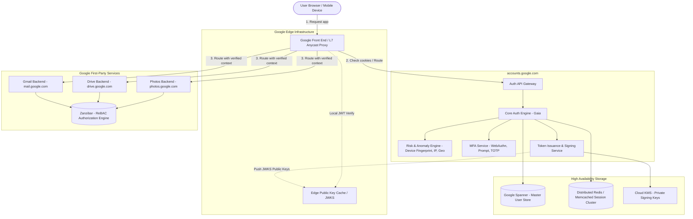
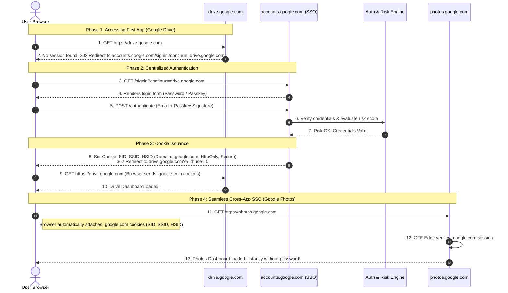
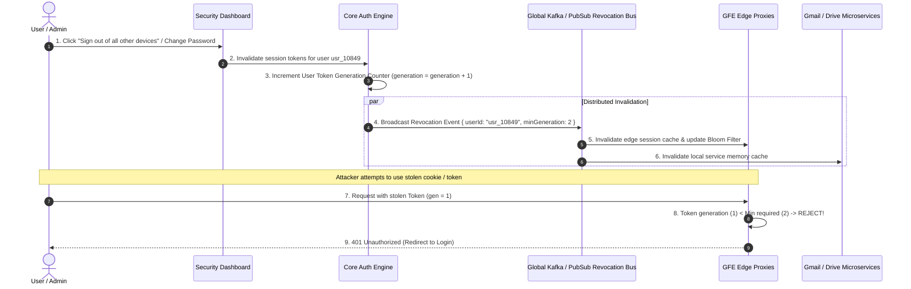

# 🌐 System Design: Google Centralized SSO & Identity Management Platform

> Architectural blueprint for **Google Accounts / Single Sign-On (SSO)** — enabling billions of users to authenticate once (`accounts.google.com`) and securely access first-party services (Gmail, Google Drive, Google Photos, YouTube, Google Cloud) as well as millions of third-party OAuth2/OIDC applications.

---

## 📑 Table of Contents

1. [System Overview & Problem Statement](#1-system-overview--problem-statement)
2. [Requirements & Scope](#2-requirements--scope)
3. [Back-of-the-Envelope Capacity Estimation](#3-back-of-the-envelope-capacity-estimation)
4. [Authentication & Authorization Protocols](#4-authentication--authorization-protocols)
5. [High-Level System Architecture](#5-high-level-system-architecture)
6. [Deep-Dive Workflow: First-Party SSO & Cross-App Access](#6-deep-dive-workflow-first-party-sso--cross-app-access)
7. [Cross-Domain Cookie Architecture & Multi-Account Switching](#7-cross-domain-cookie-architecture--multi-account-switching)
8. [Authorization & Permissions Engine (Google Zanzibar Pattern)](#8-authorization--permissions-engine-google-zanzibar-pattern)
9. [Token Revocation & Global Single Sign-Out (SLO)](#9-token-revocation--global-single-sign-out-slo)
10. [Security Engineering & Fraud Prevention](#10-security-engineering--fraud-prevention)
11. [Data Storage & Global Consistency Model](#11-data-storage--global-consistency-model)
12. [Resilience, Disaster Recovery & Caching Trade-offs](#12-resilience-disaster-recovery--caching-trade-offs)

---

## 1. System Overview & Problem Statement

Google provides hundreds of consumer and enterprise products:
- **Gmail** (`mail.google.com`)
- **Google Drive** (`drive.google.com`)
- **Google Photos** (`photos.google.com`)
- **YouTube** (`youtube.com`)
- **Google Cloud Platform (GCP)** (`console.cloud.google.com`)
- **Third-Party Apps** via "Sign in with Google"

Instead of requiring users to maintain credentials for each application, Google operates a **Centralized Identity & Access Management (IAM / SSO)** system (historically known internally as **Gaia** — *Google Accounts and ID Administration*).

### Core Goal
Allow a user to authenticate once with a single email identity (`user@gmail.com`) and:
1. Transparently access all first-party Google apps without re-entering credentials.
2. Maintain separate, least-privilege permission boundaries across products (e.g. Photos cannot access Drive files without consent).
3. Switch seamlessly between multiple logged-in accounts (e.g. personal and work accounts) in the same browser session.
4. Support instant global revocation across all connected devices and services when suspicious activity is detected or the user changes their password.

---

## 2. Requirements & Scope

### Functional Requirements
1. **Single Sign-On (SSO)**: A single authentication prompt on `accounts.google.com` establishes a valid session across all first-party domains (`*.google.com`, `youtube.com`).
2. **Federated Authorization (OAuth 2.0 & OIDC)**: Third-party apps can request scoped access (e.g., `https://www.googleapis.com/auth/drive.readonly`) with user consent.
3. **Multi-Account Support**: Users can maintain 5+ active accounts simultaneously in the same browser and switch between them via account indexing (`/u/0/`, `/u/1/`).
4. **Adaptive Multi-Factor Authentication (MFA)**: Support for TOTP, SMS, Push prompts on Android/iOS, and hardware FIDO2/WebAuthn Passkeys.
5. **Centralized & Delegated Revocation (SLO)**: Logging out or revoking a device from the Security Dashboard instantly terminates access across all apps.

### Non-Functional Requirements
1. **Extreme High Availability (99.999% — "Five Nines")**:
   - Identity is the critical path for every single Google product. Auth downtime means Google is completely inaccessible globally.
   - Maximum unplanned downtime: $\le 5.26 \text{ minutes per year}$.
2. **Ultra-Low Latency**:
   - Token validation latency: $\le 10\text{ms}$ (handled via local asymmetric key verification at edge proxies).
   - SSO login redirect latency: $\le 150\text{ms}$ end-to-end.
3. **Massive Global Scale**:
   - $2.5+\text{ Billion}$ total accounts.
   - $1.5+\text{ Billion}$ Daily Active Users (DAU).
4. **Zero-Trust Security**:
   - Complete protection against session hijacking, cookie theft, CSRF, credential stuffing, and replay attacks.
   - Strict session isolation between accounts.

---

## 3. Back-of-the-Envelope Capacity Estimation

### Traffic & Concurrency
- **Daily Active Users (DAU)**: $1.5 \text{ Billion users/day}$.
- **Login Operations per Day**:
  - Most users stay logged in; assume $10\%$ perform a fresh login, re-authentication, or token refresh per day:
    $$\text{Daily Logins} = 1.5\text{B} \times 10\% = 150\text{ Million logins/day}$$
  - Average Login QPS:
    $$\text{Average QPS} = \frac{150,000,000}{86,400} \approx 1,736 \text{ QPS}$$
  - Peak Login QPS (morning traffic spikes, outage recoveries): $\approx \mathbf{15,000 \text{ QPS}}$.
- **API Request & Token Verification QPS**:
  - Every HTTP/gRPC request to Gmail, Drive, Photos, or YouTube validates an authentication token or cookie.
  - Assume average active user generates $200$ interactions/day:
    $$\text{Total Daily Verifications} = 1.5\text{B} \times 200 = 300 \text{ Billion calls/day}$$
  - **Peak Token Verification QPS**:
    $$\text{Peak QPS} = \frac{300,000,000,000}{86,400} \times 2.5 \approx \mathbf{8,680,000 \text{ QPS}}$$
  - *Key Takeaway*: Token validation **CANNOT** query a centralized database for every request. Verification must be stateless, cryptographic, and cached at the edge!

### Storage Requirements
- **User Account Profiles**:
  - $2.5 \text{ Billion accounts} \times 4 \text{ KB (profile, hashed credentials, recovery data, public keys)} \approx \mathbf{10 \text{ TB}}$.
- **Active Sessions**:
  - $1.5 \text{ Billion active users} \times 3 \text{ devices/user} = 4.5 \text{ Billion active sessions}$.
  - $4.5 \text{ Billion} \times 1 \text{ KB metadata} \approx \mathbf{4.5 \text{ TB}}$ stored across distributed in-memory cache and Spanner.

---

## 4. Authentication & Authorization Protocols

```
+-----------------------------------------------------------------------------------+
|                                 Google Identity Stack                             |
|                                                                                   |
|  +-----------------------------+        +---------------------------------------+ |
|  |     OpenID Connect (OIDC)   |        |               OAuth 2.0               | |
|  |     [Identity / Who am I]   |        |       [Delegated Authorization]       | |
|  |  Returns ID Token (JWT)     |        |  Returns Access Token & Refresh Token | |
|  +-----------------------------+        +---------------------------------------+ |
|                 ^                                           ^                     |
|                 +---------------------+---------------------+                     |
|                                       |                                           |
|                      +---------------------------------+                          |
|                      |   FIDO2 / WebAuthn / Passkeys   |                          |
|                      |   Hardware-backed Cryptography  |                          |
|                      +---------------------------------+                          |
+-----------------------------------------------------------------------------------+
```

### Token Types & Strategy

| Token Type | Format | Lifetime | Purpose | Storage / Transport |
| :--- | :--- | :--- | :--- | :--- |
| **Session Cookie (`SID`, `SSID`, `HSID`)** | Opaque Encrypted String | 14–30 Days | Maintains browser session across all `*.google.com` subdomains | HTTP-only, Secure, SameSite Cookie |
| **ID Token** | Signed JWT | 1 Hour | Proves user identity to client applications (OpenID Connect) | Client Memory |
| **Access Token** | Asymmetrically Signed JWT | 15–60 Minutes | Scoped token for calling APIs (e.g. Drive API, Gmail API) | Memory / Edge Cache |
| **Refresh Token** | Opaque Cryptographic Hash | Months / Revoked | Exchanges for new Access Tokens without prompting the user | Secure Vault / Database |

---

## 5. High-Level System Architecture



### Architecture Component Responsibilities

1. **Google Front End (GFE)**:
   - High-throughput Anycast Layer 7 load balancer.
   - Terminates TLS, inspects incoming `SID`/`HSID` session cookies or `Authorization: Bearer <JWT>`.
   - Validates JWT signatures directly at the edge using cached public keys (`EdgeCache`), shielding internal microservices from millions of token validation calls.
2. **Central Auth Service (Gaia)**:
   - Evaluates credentials (passwords, Passkeys/WebAuthn public key challenges).
   - Generates and manages user master identities.
3. **Risk & Anomaly Engine**:
   - Analyzes real-time signals: IP address reputation, geographic velocity (e.g. login from New York, then Tokyo 10 minutes later), device fingerprint, and known compromised passwords.
   - Dynamically triggers step-up verification (e.g., "Tap Yes on your phone").
4. **Token Issuance & Signing Service**:
   - Issues short-lived Access Tokens and OIDC ID Tokens signed via **RS256** or **EdDSA (Ed25519)** using hardware security keys hosted in **Cloud KMS**.
   - Publishes public verification keys via JSON Web Key Set endpoint (`/oauth2/v3/certs`).
5. **Google Spanner**:
   - Globally distributed, synchronously replicated SQL database powered by TrueTime API.
   - Guarantees external consistency for user credentials, recovery emails, and active security settings.
6. **Zanzibar (Authorization Engine)**:
   - Google’s global ReBAC (Relationship-Based Access Control) engine.
   - Determines: *"Does User U have read permission on Document D in Google Drive?"*

---

## 6. Deep-Dive Workflow: First-Party SSO & Cross-App Access

### Scenario: User logs in to access Google Drive, then seamlessly opens Google Photos.



### What happens behind the scenes in Step 8 & 9?
1. `accounts.google.com` issues session cookies scoped to the root domain:
   - `Domain=.google.com`
   - `Path=/`
   - `HttpOnly` (inaccessible to JavaScript)
   - `Secure` (only transmitted over TLS)
   - `SameSite=Lax`
2. Because the cookie is set on `.google.com`, any subsequent request to any subdomain (`drive.google.com`, `mail.google.com`, `photos.google.com`, `docs.google.com`) **automatically carries the session cookies in the HTTP request headers**.
3. The GFE proxy terminates the request, validates the session against the local edge cache, injects an authenticated user header (`X-Forwarded-User-Id: 1084920491`), and forwards the request to the target service.

---

## 7. Cross-Domain Cookie Architecture & Multi-Account Switching

### 1. The Multi-Account URL Routing Pattern (`/u/0/`, `/u/1/`)
Google allows logging into personal (`alice@gmail.com`) and work (`alice@company.com`) accounts in the same browser.

#### How it works:
- Instead of keeping only one user in the session cookie, Google’s `SID` cookie represents a **Session Jar** referencing an array of authenticated account IDs:
  ```json
  {
    "accounts": [
      { "index": 0, "userId": "usr_99182", "email": "alice@gmail.com" },
      { "index": 1, "userId": "usr_44102", "email": "alice@company.com" }
    ]
  }
  ```
- URL paths include the account index:
  - `https://mail.google.com/mail/u/0/` $\rightarrow$ Routes to `alice@gmail.com`.
  - `https://mail.google.com/mail/u/1/` $\rightarrow$ Routes to `alice@company.com`.
- When making backend calls, the GFE uses the `/u/{index}/` path parameter to pick the corresponding account context from the session cookie.

### 2. Cross-Domain SSO for Non-`.google.com` Properties (e.g., YouTube)
YouTube lives on a completely separate top-level domain: `youtube.com`. Web security (Same-Origin Policy) forbids `youtube.com` from reading cookies set on `.google.com`.

#### How Cross-Domain Token Exchange solves this:
1. User is logged into Google (`.google.com`) and visits `youtube.com`.
2. YouTube detects no `youtube.com` session cookie.
3. YouTube redirects the browser to:
   ```
   https://accounts.google.com/ServiceLogin?service=youtube&continue=https://www.youtube.com/signin?action_handle_signin=true
   ```
4. The browser hits `accounts.google.com` and automatically attaches the `.google.com` session cookies.
5. Google SSO verifies the session and redirects back to YouTube with a one-time cryptographic authorization ticket:
   ```
   https://www.youtube.com/signin?ticket=TKT_a9f8b27c109...
   ```
6. The YouTube backend exchanges this ticket via internal server-to-server RPC with Google Auth to establish a native session cookie on `.youtube.com`.

---

## 8. Authorization & Permissions Engine (Google Zanzibar Pattern)

Authentication establishes **who you are** (`alice@gmail.com`). Authorization determines **what you are allowed to do** inside each app.

Google uses **Zanzibar**, a globally distributed relationship-based authorization system:
- Stores over **10 Trillion ACL relations**.
- Evaluates **10+ Million authorization checks per second**.
- Computes permissions in **< 3ms**.

```
+-----------------------------------------------------------------------------+
|                               Zanzibar Model                                |
|                                                                             |
|      Namespace:Object#Relation@User                                         |
|                                                                             |
|  Examples:                                                                  |
|  - doc:resume_2026#owner@alice                                              |
|  - doc:resume_2026#viewer@bob                                               |
|  - folder:work_projects#viewer@group:engineering#member                     |
+-----------------------------------------------------------------------------+
```

### Zanzibar Workflow for Cross-App Operations
When Google Photos attempts to export a photo to Google Drive:
1. User grants the Photos service an OAuth access token with scope `drive.file`.
2. Photos calls `drive.googleapis.com/upload` presenting the token.
3. Drive queries Zanzibar: `Zanzibar.Check(user=alice, relation=editor, object=target_folder)`.
4. Zanzibar checks relation tuples using distributed cache and TrueTime consistency tokens (**Zookies**) to prevent reading stale permissions, returning `ALLOW` or `DENY`.

---

## 9. Token Revocation & Global Single Sign-Out (SLO)

One of the hardest problems in distributed systems is: **How do you immediately revoke access across hundreds of microservices when short-lived cryptographic tokens are cached at the edge?**



### Two-Tier Revocation Strategy
1. **Token Generation Counters (Asynchronous & Fast)**:
   - Each user profile in Spanner holds an integer `token_generation`.
   - Every issued token encodes this generation number in its claims: `{ "sub": "usr_10849", "gen": 1 }`.
   - When a password is changed or a logout occurs, `token_generation` increments to `2`.
   - Edge proxies check if `token.gen >= user.current_gen`. If not, the token is rejected immediately.
2. **Distributed In-Memory Bloom Filters for Blacklisted Session IDs**:
   - For individual device revocations, invalidated Session IDs (`SID`) are published to a high-speed Kafka topic consumed by all GFE edge proxies.
   - Proxies maintain an in-memory Bloom filter and LRU cache of revoked session hashes for immediate rejection within milliseconds globally.

---

## 10. Security Engineering & Fraud Prevention

### 1. Risk-Based Adaptive Authentication Engine
During every login attempt, the Risk Engine scores the request ($0.0 \text{ to } 1.0$ risk score) based on:
- **Device Fingerprint**: Canvas hash, TLS client hello fingerprint (JA3), OS/browser combination.
- **Network Profile**: Residential IP vs Datacenter/VPN/Tor node.
- **Impossible Travel**: Login from California followed by a login from Germany 20 minutes later.
- **Behavioral Biometrics**: Typing speed and cadence during credential entry.

**Action Matrix**:
- `Risk < 0.2`: Direct login with seamless SSO.
- `0.2 <= Risk < 0.7`: Challenge with 2FA prompt (Android/iOS push notification or Passkey).
- `Risk >= 0.7`: Hard block, require security key + recovery email confirmation.

### 2. Cookie Theft & Session Hijacking Mitigation
- **Bound Cookies (DPoP / Device Bound Session Credentials)**:
  - Cryptographically binds the browser session to a private key stored in the client hardware (TPM / Apple Secure Enclave).
  - Even if malware steals the cookie from the browser disk, the cookie is useless on the attacker's machine without the hardware-locked private key signature.
- **Triple-Cookie Pattern (`SID`, `SSID`, `HSID`)**:
  - `SID`: Identifies user identity across subdomains.
  - `HSID`: Signed hash of the user ID, timestamp, and client IP prefix to prevent cookie reuse from different geographic subnets.
  - `SSID`: Secure-flagged cookie strictly restricted to HTTPS.

---

## 11. Data Storage & Global Consistency Model

### Google Spanner Database Schema

```sql
-- Master User Account Entity
CREATE TABLE Users (
    user_id STRING(64) NOT NULL,
    primary_email STRING(255) NOT NULL,
    password_hash STRING(255) NOT NULL, -- Argon2id / Scrypt
    token_generation INT64 NOT NULL,
    mfa_enabled BOOL NOT NULL,
    created_at TIMESTAMP NOT NULL,
    updated_at TIMESTAMP NOT NULL OPTIONS (allow_commit_timestamp = true)
) PRIMARY KEY (user_id);

-- Hardware Keys & Passkeys (WebAuthn Credentials)
CREATE TABLE UserPasskeys (
    passkey_id STRING(128) NOT NULL,
    user_id STRING(64) NOT NULL,
    public_key_pem STRING(1024) NOT NULL,
    sign_counter INT64 NOT NULL,
    device_label STRING(100),
    registered_at TIMESTAMP NOT NULL
) PRIMARY KEY (user_id, passkey_id),
  INTERLEAVE IN PARENT Users ON DELETE CASCADE;

-- Active Distributed User Sessions
CREATE TABLE UserSessions (
    session_id STRING(128) NOT NULL,
    user_id STRING(64) NOT NULL,
    device_fingerprint STRING(255) NOT NULL,
    ip_country STRING(2),
    created_at TIMESTAMP NOT NULL,
    expires_at TIMESTAMP NOT NULL,
    is_revoked BOOL NOT NULL
) PRIMARY KEY (user_id, session_id),
  INTERLEAVE IN PARENT Users ON DELETE CASCADE;
```

### Why Google Spanner?
- **Global External Consistency (Serializable Transactions)**: Enabled by atomic hardware clocks (**TrueTime API**), ensuring that when a user updates their password in London, a concurrent login attempt in Singapore immediately sees the new password without replication delay.
- **Interleaved Tables**: `UserPasskeys` and `UserSessions` are stored physically co-located on disk with the parent `Users` record, ensuring single-seek disk I/O when authenticating a user.

---

## 12. Resilience, Disaster Recovery & Caching Trade-offs

### 1. Multi-Region Active-Active Redundancy
- Google operates dozens of global data centers. The SSO service runs in active-active configuration across all regions.
- If an entire region goes dark (e.g. fiber cut in North America), Anycast BGP routing routes traffic to the nearest surviving region in under 3 seconds.

### 2. Graceful Degradation & Edge Verification
If the core database cluster experiences catastrophic degradation:
- **Existing Logged-In Users**: Continue working uninterrupted! Edge GFEs validate existing short-lived JWT tokens locally using cached public keys (`JWKS`) without contacting the database.
- **New Logins**: Queued or throttled via token bucket rate limiters, presenting users with helpful status pages rather than cascading crashes.

---

## 📊 Summary Architecture Matrix

| Dimension | Architectural Strategy |
| :--- | :--- |
| **Authentication Protocol** | OpenID Connect (OIDC) + FIDO2 / WebAuthn Passkeys |
| **Session Model** | Centralized `.google.com` Root Domain Cookies (`SID`, `SSID`, `HSID`) |
| **Cross-Domain SSO** | Cryptographic One-Time Ticket Exchange via Front-Channel Redirection |
| **Multi-Account Handling** | URL Path Indexing (`/u/0/`, `/u/1/`) mapped to multi-account cookie jar |
| **Authorization Check** | Google Zanzibar Relationship-Based Access Control (ReBAC) |
| **Token Validation** | Stateless Edge Verification via JWKS Public Keys (Sub-millisecond) |
| **Global Revocation** | Token Generation Counters + Event Bus (Pub/Sub) + Edge Bloom Filters |
| **Master Database** | Google Spanner with TrueTime API (Global External Consistency) |
| **Target Scale** | 2.5B+ Users, 15k Login QPS, 8.6M+ Token Verifications/Sec, 99.999% Uptime |
